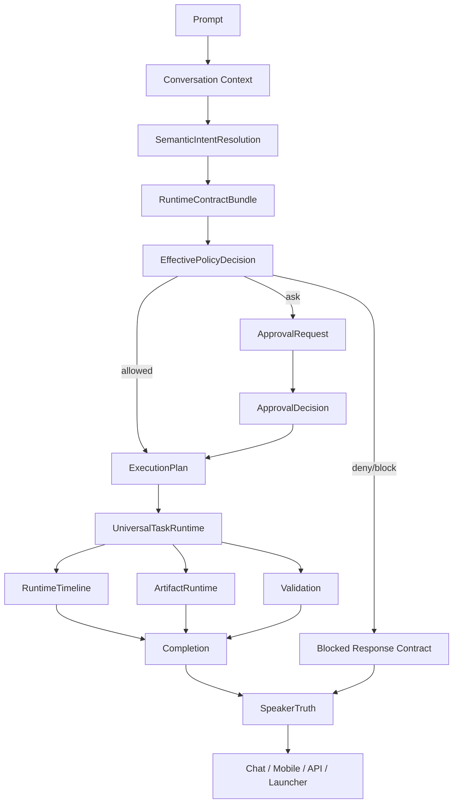

# AIpinho - Canonical Flow

Status: CANONICAL_FLOW_DEFINED

## Mandatory Flow

## Who Commands Whom

1. External clients do not command runtime directly.
2. Routers do not decide intent, policy, task state, or final truth.
3. `SemanticIntentResolution` produces intent and semantic context.
4. `RuntimeContractBundle` carries all operational meaning forward.
5. `EffectivePolicyDecision` is the only permission authority.
6. `UniversalTaskRuntime` is the only execution authority.
7. `RuntimeTimeline` is the only operational state authority.
8. `SpeakerTruth` is the only final answer authority.

## Forbidden Parallel Flows

- Chat router interpreting intent directly.
- Permission grant parser overriding semantic intent.
- Session diagnostic hijacking operational prompts.
- Project generation runtime creating TaskRun without executable plan.
- Approval creation without draft/plan binding.
- Mobile or Launcher deriving status independently.
- Validation passing when completion is blocked or outputs are missing.
- Artifact creation without task_run/producer binding.

## Compatibility Rule

Old endpoints may remain temporarily, but they must become adapters that call the canonical authority and do not implement independent logic.

## Wave 1 Implementation Note

`SemanticIntentResolutionService` is now the canonical prompt-level entrypoint for lifecycle intent and permission-grant gating. Existing deterministic rules in `CanonicalIntentRouter` are retained as the internal signal collector, not as a separate public authority. Chat-facing routers may still translate the canonical decision into legacy operation names while consumers migrate, but they must not bypass semantic resolution for read-only, permission grant, approval command, shell, write, or project/bootstrap intent.

## Wave 2 Implementation Note

`EffectivePolicyDecisionService` is now the canonical lifecycle boundary for `allowed` / `ask` / `denied` / `blocked` decisions. `CanonicalPolicyService` remains an internal normalizer and resolver beneath this boundary. Legacy `PolicyKernelService` decisions may be adapted into canonical lifecycle vocabulary, but they are no longer considered a second runtime policy authority.

Invalid, expired, and stale upstream policy states are blocked deterministically. No unknown policy vocabulary may fall through to implicit `allowed`.

## Wave 3 Implementation Note

`TaskRuntimeService.create_run` is retained as the canonical Universal Task Runtime entrypoint and uses `TaskBootstrapRuntimeService` before any `TaskRun` is persisted. `TaskRunGuard` now enforces that execution cannot start from an orphan or mismatched runtime record.

Required runtime identity:

- `task_id`
- `task_run_id`
- `operation_id`
- `bootstrap_context.task_id`
- `bootstrap_context.task_run_id`
- `bootstrap_context.operation_id`

Approval runtime context now binds `ApprovalRequest.task_id` to the canonical task id and keeps `run_id` as the task-run reference.

## Wave 4 Implementation Note

`RuntimeTimelineService` is the canonical TaskRun timeline projection. `TaskRunEventService` is the canonical TaskRun event writer for governed runtime events.

Execution cannot start unless the persisted TaskRun has an initial contiguous event chain containing:

- `run_created`
- `task_bootstrap_created`

This preserves the invariant that every runtime execution is observable from the beginning. Historical/manual TaskRun data may still be read for compatibility, but it cannot be executed until it is represented through the canonical timeline contract.

## Wave 5 Implementation Note

`ArtifactRuntimeService` is the canonical Artifact Runtime boundary. Runtime outputs must be represented as artifacts with logical identity, storage identity, producer step, task binding, task-run binding, and producer event binding before they can become authoritative evidence.

Canonical artifact invariants:

- `logical_path` is a governed artifact path, not a workspace write path.
- Artifact generation is not workspace mutation.
- `UniversalArtifactRegistryService` is the internal registry/store behind ArtifactRuntime, not a parallel public authority.
- Artifacts without `task_id`, `task_run_id`, or `event_id` remain historical data but fail strict evidence validation.
- Runtime Doctor read-only reports may use declared diagnostic report binding when diagnosing raw contracts that do not yet carry an observed TaskRun.

## Wave 6 Implementation Note

`RuntimeTruthEngine` is the canonical operational SpeakerTruth authority for TaskRun-facing runtime consumers. Final success is allowed only when runtime status, workflow, timeline, validation, completion, and artifact evidence agree.

Canonical SpeakerTruth invariants:

- `TaskRunResult.status == completed` is not enough to mark the operation complete.
- `CanonicalOperationState.status == COMPLETED` requires `RuntimeTruth.safe_to_report_success == true`.
- Universal Task Session safe-success fields are mirrors of canonical operation state.
- Orphan artifact evidence blocks success claims.
- Legacy `SpeakerService` may compose conversation/preview/block text, but operational success claims must derive from RuntimeTruth.

## Wave 7 Implementation Note

Repository consolidation is data ownership consolidation, not a new runtime authority. No repository facade or parallel registry was introduced.

Canonical data ownership decisions:

- Context usage audit plans now live under `data/runtime/context/plans`.
- `ContextUsageAuditService` resolves its configured and fallback storage to that canonical path.
- Historical plan files were physically migrated from `data/runtime/context_plans` with a reversible manifest.
- Empty legacy roots `data/runtime/tasks` and `data/runtime/artifacts` were archived under `data/runtime/repository_legacy/empty_dirs` instead of deleted.
- Active stores for TaskRuns, approvals, events, artifact previews/writes, and artifact storage were not moved because their consumers are still live and configured.

Repository Wave 7 keeps the invariant that data movement follows configured ownership and consumer safety. Physical migration is allowed only when the store owner and storage path can be updated without creating a second access path.
