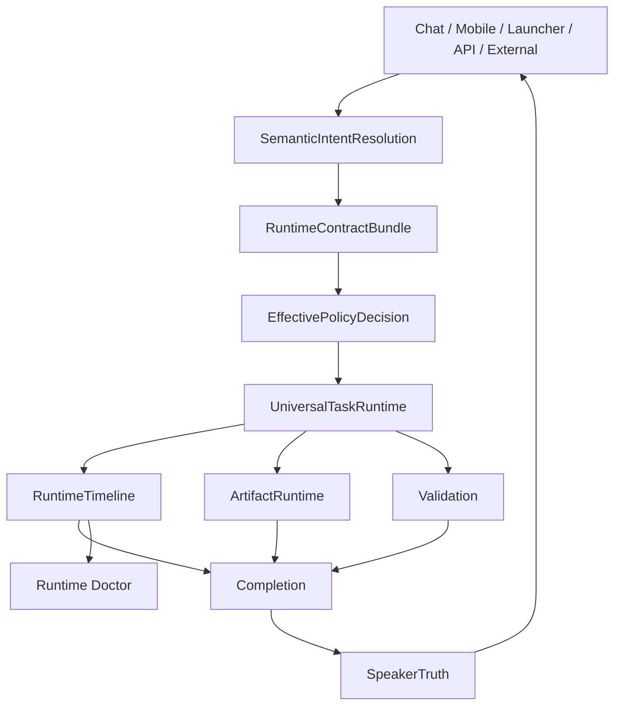
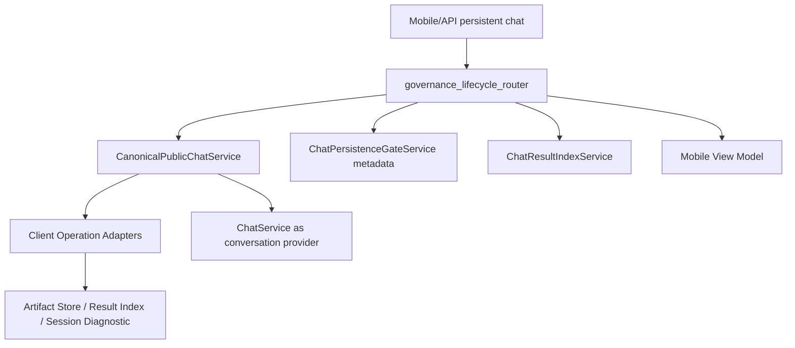

# AIpinho - Final Architecture

Status: TARGET_ARCHITECTURE_DRAFT

## Final State

AIpinho becomes a governed runtime with five authorities:

## Architectural Meaning

- Semantic understands.
- Contracts carry meaning.
- Policy decides.
- Runtime executes.
- Timeline records.
- Artifacts prove.
- Validation verifies.
- SpeakerTruth speaks.

No other component may own equivalent responsibility.

## Data Ownership Rule

Runtime data stores must belong to the same canonical domain that owns their lifecycle.

- TaskRun data belongs to UniversalTaskRuntime.
- Events/timeline data belongs to RuntimeTimeline.
- Artifact data belongs to ArtifactRuntime.
- Context planning/audit data belongs under the context runtime store.
- Empty or obsolete data roots are archived with manifest-backed reversibility before any deletion is considered.

Wave 7 applied this rule by migrating context plan data into `data/runtime/context/plans` and by archiving empty legacy roots without creating a repository facade.

## Wave 7.5 Compatibility State

Wave 7.5 removed an obsolete internal chat shim and tightened core identity semantics:

- Persistent chat now routes through `governance_lifecycle_router` and `CanonicalPublicChatService`.
- Persistent chat workspace-context extraction is owned by `PersistentChatWorkspaceContextService`.
- Context/RAG prompt policy checks are owned by `ContextPromptPolicyService`.
- Core runtime outputs prefer canonical `task_id`, while TaskRun references remain in `task_run_id`, `result_ref_id`, metadata, evidence refs, and task-run actions.
- Approval continuation stores `ApprovalRequest.run_id` and `ApprovalRequest.task_id` separately.

The architecture is not final yet. Remaining external/manual/debugger run identifiers must be migrated only after their domains have explicit Universal Task or external participant contracts.

## Wave 8 Client Alignment State

Persistent Mobile/API chat now follows the canonical public path:

The important architectural change is that Mobile does not need to infer finality from raw text. The route persists `message_type`, `status`, `result_ref_id`, artifacts, approval flags, grounding flags, and evidence metadata from the canonical response.
