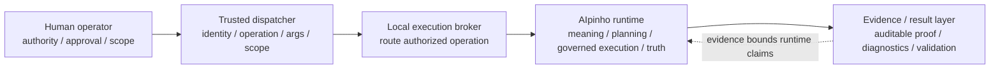
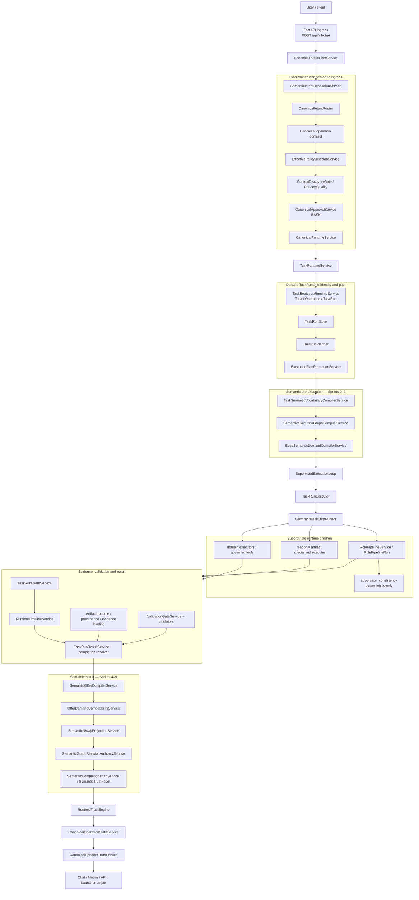
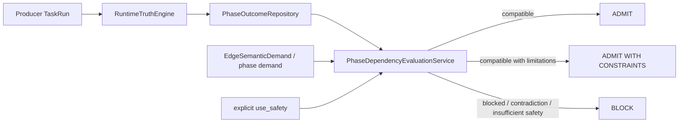
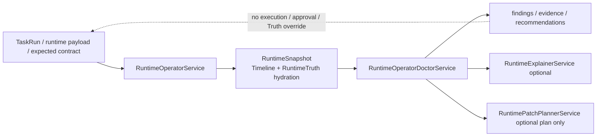

# AIpinho Current Runtime Map — 2026-09-15

> Verified against GitHub `main` and the matching local Git object at runtime consolidation commit `6126a73a9ddfc054fe527174fe4df16740b9d1e0`. Current production code, canonical config/contracts and validated runtime evidence remain authoritative.

Status: `CONSOLIDATED_VALIDATED`.

## 1. Five canonical authorities



| Authority | Owns | Must not become |
|---|---|---|
| Human operator | permission, approval, policy/scope choice | implicit model authority |
| Trusted dispatcher | identity/operation/args/scope validation and fixed capability invocation | NL interpreter or semantic planner |
| Local execution broker | routing authorized Git/tests/build/FireTest/AIpinho operations | second orchestration brain |
| AIpinho runtime | meaning, intent, contract, plan, governed execution, evidence binding, validation, RuntimeTruth and SpeakerTruth ceiling | bypass/parallel product runtime |
| Evidence/result layer | auditable outputs, diagnostics, validation evidence | success authority independent of runtime truth |

Operational rule: the runner/dispatcher is deliberately dumber than AIpinho — **validate → authorize → execute → observe → return**.

## 2. Canonical public governed path



## 3. Semantic execution ownership — Sprints 0–9

| Stage | Current owner | Authority rule |
|---|---|---|
| S0/system vocabulary | `SystemSemanticVocabularyService` + canonical schemas/config | shared meaning, not model invention |
| S1 task vocabulary | `TaskSemanticVocabularyCompilerService` | typed task concepts/states frozen before execution |
| S2 semantic graph | `SemanticExecutionGraphCompilerService` | work-unit topology; partial structure remains explicit |
| S3 edge demand | `EdgeSemanticDemandCompilerService` | consumer-local requirements; demand is edge-local |
| S4 semantic offer | `SemanticOfferCompilerService` | producer offer derived from governed evidence |
| S5 compatibility | `OfferDemandCompatibilityService` | admit/constrain/block independently per edge |
| S6 N-way | `SemanticNWayProjectionService` | fan-in/fan-out/join projection without collapsing edge truth |
| S7 revision | `SemanticGraphRevisionAuthorityService` | active child revision invalidates historical authority |
| S8 completion | `SemanticCompletionTruthService` | ready/constrained/blocked/insufficient-evidence facet |
| S9 truth/publication | `RuntimeTruthEngine` → `CanonicalOperationStateService` → `CanonicalSpeakerTruthService` | no claim above governed truth |

Canonical semantic chain:

```text
meaning → intent → contract → entities/goals → capability matching
→ TaskSemanticVocabulary → SemanticExecutionGraph → EdgeSemanticDemand
→ governed execution → evidence → SemanticOffer
→ Offer/Demand compatibility → N-way semantics → graph revision
→ validation/completion → SemanticTruthFacet → RuntimeTruth
→ CanonicalOperationState → SpeakerTruth
```

## 4. PhaseOutcome and downstream admission

`TaskRun` completion and producer evidence are inputs, not downstream authority by themselves.



Rules:

- `RuntimeTruth=blocked/failed/cancelled/expired` forces the producer dependency to blocked.
- `RuntimeTruth=partial` is not a success claim.
- partial evidence may be consumable only when downstream demand and explicit producer use-safety are compatible.
- `CanonicalOperationState=BLOCKED` on a partial operation prevents success/UI claims; it does not erase bounded evidence that is explicitly safe for a narrower downstream use.
- the same Offer may be admitted, constrained or blocked on different edges.

## 5. Roles and model boundaries

Roles are cognitive children of the canonical runtime. They are not authorities in the five-authority chain and they do not own TaskRun lifecycle.

| Mechanism | Current status | Authority ceiling |
|---|---|---|
| `SemanticIntentResolutionService` | live canonical prompt-intent authority | deterministic operational intent resolution |
| `SemanticInterpreterPipeline` / `semantic_interpreter` | enabled bounded candidate subsystem | proposal only; deterministic gates validate |
| model role `interpreter` | role-pipeline explanatory pass | no operational intent authority |
| `RolePipelineService` | live and TaskRuntime-bound | parent TaskRun/operation/execution required |
| `RolePassRunner` | live role-pass executor | policy/contract bounded; no tools/write expansion |
| `RoleInferenceService` | reachable specialized subsystem | bounded model inference; no lifecycle/Truth authority |
| `speaker` model role | wording/generation | cannot override RuntimeTruth |
| `CanonicalSpeakerTruthService` | live publication authority ceiling | governs what may be claimed |
| `supervisor_consistency` | live deterministic role pass | `real_inference=false`; cannot expand authority |

The latest FireTest proved `run_role_pipeline` actually executed in all six TaskRuns. This closes the previous plan-vs-execution bypass.

## 6. Specialized readonly artifact path

`ReadonlyAnalysisArtifactRuntimeService` remains a live public/specialized boundary, but after consolidation it is not a second runtime implementation.

It may provide specialized analysis/artifact execution logic, semantic phase policy and artifact contracts. TaskRuntime remains the exclusive owner of durable TaskRun lifecycle, terminal result construction, RuntimeTruth and CanonicalOperationState.

Conceptually:

```text
public readonly artifact request
  → canonical TaskRuntime reservation/planning
  → readonly_artifact_analysis runtime profile
  → GovernedTaskStepRunner
  → specialized readonly analysis/artifact executor
  → RolePipeline child when planned
  → canonical validation/completion/RuntimeTruth
```

## 7. Compatibility / inventory plane

The following code exists and may be instantiated/configured, but is not the canonical execution authority:

- `RuntimeContractsV2Service`
- `PlannerV2`
- `RuntimeDispatcherV2`
- `IntelligentPlannerService`
- `ExecutionGraphService`
- `ContinuousRuntimeService`

GitHub reachability checks showed `RuntimeDispatcherV2`/`RuntimeContractsV2Service` primarily through Runtime Operator inventory and tests. `IntelligentPlannerService`, `ExecutionGraphService` and `ContinuousRuntimeService` are instantiated by `TaskRuntimeService`, but the current scan found no subsequent `self.*` consumption in the canonical TaskRun path.

These surfaces should be treated as compatibility/inventory until an evidence-backed migration either removes them or explicitly promotes bounded functionality into the canonical path.

## 8. Diagnostic plane



Doctor authority ceiling: **diagnose / explain / plan ≠ approve / execute / patch / override RuntimeTruth**.

## 9. Runtime profiles

Current profile inventory includes:

- `conversation`
- `readonly_analysis`
- `readonly_artifact_analysis`
- `artifact_generation`
- `patch`
- `project_bootstrap`
- `project_generation`
- `shell`
- `validation`
- `web_search`
- `write_file`
- `delegation_parent`

Profiles select bounded steps/actions; they do not create independent runtime authority.

## 10. Current validated evidence

FireTest 5 consolidation campaign: `firetest5_runtime_consolidation_20260915T152207Z`.

| Phase | RuntimeTruth | Downstream status / claim posture |
|---|---|---|
| 1 | `partial` | `satisfied_with_limitations`; success claim forbidden |
| 2 | `completed` | completed |
| 3 | `completed` | completed |
| 4 | `completed` | completed; old contradiction did not recur |
| 5 | `completed` | completed |
| 6 | `completed` | completed; old timeline gap did not recur |

Campaign-wide:

- event sequences: contiguous and unique in all six phases;
- duplicates: `0`; missing sequences: `0`;
- Runtime Doctor: completed all phases, including former Phase 4/6 large-run cases;
- role pipeline: executed in all six TaskRuns;
- supervisor consistency: deterministic and completed;
- target workspace files/bytes unchanged;
- corpus files/bytes unchanged;
- final queue clean;
- final post-reboot consolidated regression: `174 passed / 0 failed`.

Canonical reports:

- `reports/runtime_consolidation/runtime_consolidation_final_validation_20260915.md`
- `reports/runtime_consolidation/runtime_consolidation_firetest5_20260915.json`

## 11. Genome v2 classification

| Classification | Meaning |
|---|---|
| `CANONICAL` | current live authority-bearing product path |
| `SPECIALIZED_CHILD` | live subordinate executor/cognitive child inside canonical runtime |
| `DIAGNOSTIC` | read-only observability/diagnosis |
| `COMPATIBILITY` | configured/instantiated compatibility or inventory surface outside canonical execution authority |
| `SUPPORTING` | active support service outside the central authority chain |
| `LEGACY` | explicitly retired/legacy namespace |
| `TEST_ONLY` | validation/test code |
| `EVIDENCE` | bounded historical/current evidence |
| `GENERATED` | derived architecture snapshot |

Genome source: `genome/00_manifest.json`.
Folder-by-folder audit: `genome/reports/github_folder_audit_20260915.md`.

## 12. Current frontier

The consolidation defects previously listed in this map are closed by the implementation and fresh FireTest evidence. There is no open P0/P1 from that wave.

Current posture:

1. evolve capability only through the single canonical TaskRuntime;
2. preserve the five-authority chain without promoting models/roles/diagnostics;
3. retire or absorb compatibility surfaces only with explicit tests/evidence;
4. keep semantic truth edge-local where required and final product claims RuntimeTruth-bound;
5. keep generated Genome/orientation synchronized after architecture-changing waves;
6. leave the Windows subprocess `cp1252/.m4a` reader issue explicitly deferred until separately scoped.

## 13. Non-negotiable invariants

- `MODEL != AUTHORITY`.
- unknown is fail-closed.
- no execution without contract.
- execution completion != semantic admission.
- producer completion != consumer authorization.
- Demand is edge-local.
- graph revision cannot inherit stale historical authority.
- artifact existence != semantic fulfillment.
- `run_completed != safe success`.
- Runtime Doctor diagnoses; RuntimeTruth governs safe operational claims.
- SpeakerTruth cannot claim above RuntimeTruth.
- FireTest is evidence, never runtime configuration.

> Context Pack note: this mirror is orientation only; the repository runtime map and current code/evidence remain authoritative.
