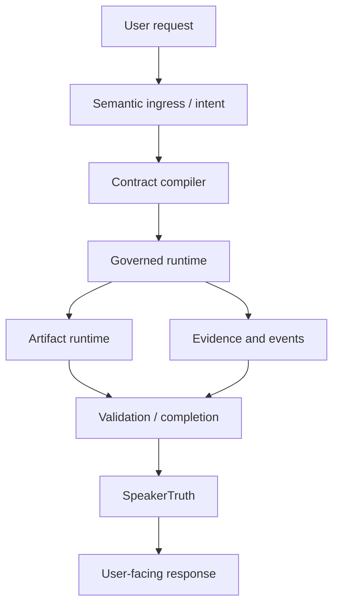

# AIpinho

AIpinho is a local, experimental, governed AI runtime. Its current focus is not
to "look intelligent" by filling fields or hiding failures. Its focus is to turn
language into governed work with explicit contracts, evidence, validation,
terminal state, and user-facing truth boundaries.

The project is still experimental. FireTest 5 is not ready as of H1C0.R2.18.

## Core Idea

The runtime is being shaped around this operational chain:

```text
language
-> meaning
-> intention
-> contract
-> intermediate representation / plan
-> governed execution
-> evidence
-> validation
-> completion
-> SpeakerTruth
-> user-facing report
```

The important rule is that each boundary must preserve what is known, what is
unknown, what was observed, what was derived, and what cannot yet be claimed.

## Governing Principles

- Do not invent.
- Do not hide failures.
- No execution without a contract.
- No validation without evidence.
- No success without SpeakerTruth.
- Specific semantic/runtime reason beats generic timeout.
- Artifact existence is not semantic success.
- Result existence is not completion.
- Candidate is not truth.
- Derived is not observed.
- Unknown is not false.
- Terminality must be explicit: completed, blocked, failed, or cancelled.
- Runtime projections must stay bounded and observable.

These principles are reflected in the current H1C0 reports, the runtime
services under `src/aipinho/services`, the policy/config files under `config/`,
and the historical design material under `archaeology/` and `genome/`.

## Current Architecture

AIpinho is a Python/FastAPI project with a config-first and contract-first
runtime. The current codebase contains:

- API routers in `src/aipinho/api/routers`.
- Runtime, governance, artifact, validation, semantic, speaker, and CVL services
  under `src/aipinho/services`.
- Pydantic schemas under `src/aipinho/schemas`.
- Config and policy files under `config/`.
- Tests under `tests/`.
- Desktop/mobile launcher and companion app code under `apps/`.
- Runtime consolidation evidence under `reports/runtime_consolidation`.

The generated genome summary describes the project as a modular architecture
with entrypoint, core, utility, service, API, repository, registry, adapter, and
schema layers. That genome is a design map, not a live runtime authority by
itself.



## Repository Map

- `src/` - production Python package.
- `tests/` - unit, integration, workflow, security, and regression tests.
- `config/` - policy, runtime, model, artifact, memory, validation, UX, and
  governance configuration.
- `apps/` - launcher/mobile application surfaces and related code.
- `scripts/` - operational scripts for starting, stopping, packaging, and
  auditing local runtime components.
- `docs/` - architecture, operations, testing, mobile, sandbox, skills, and
  integration documentation.
- `archaeology/` - historical storage/report archaeology. This is conceptual
  context, not automatic live authority.
- `genome/` - generated architecture/design DNA maps and summaries. These are
  useful for orientation and invariants, but current code and validated reports
  win when there is a conflict.
- `reports/runtime_consolidation/` - bounded wave reports used as operational
  evidence.

Local runtime state, payload refs, generated artifacts, caches, binary model
runtimes, and raw heavy FireTest dumps are intentionally ignored by Git.

## Archaeology

`archaeology/` contains bounded historical notes:

- `L8_data_archaeology.md`
- `L9_reports_archaeology.md`
- `storage_manifest.md`

These files help explain how storage and reports evolved. They should not be
treated as proof that a runtime component is still active.

## Genome

`genome/` contains generated maps of architecture, runtime services, contracts,
events, data stores, roles, tools, and tests. The summary reports are:

- `genome/reports/genome_summary.md`
- `genome/reports/genome_statistics.md`

The genome is design DNA and orientation material. It is included in the
repository because it explains intent and invariants, but it does not override
current code, current configs, or validated runtime evidence.

## Current Frontier

Published baseline:

```text
H1C0.R2.16 =
FIRETEST5_H1C0_R2_16_CSV_CARDINALITY_STREAMING_DETERMINISM_BLOCKED_WITH_CORE_FIX_VALIDATED

FireTest 5 = NOT_READY
```

R2.16 proved and fixed:

- CSV progress was previously misclassified as a generic stall.
- The terminal reason is now `MUSIC_INVENTORY_CSV_STREAMING_BUDGET_EXCEEDED`
  for progressing work that exceeds its budget.
- Cardinality domains were reconciled:
  source context entities, selected/projected entities, row-model rows, skipped
  rows, and CSV expected rows are now separately observable.
- A/B public runs had matching digests for input entity set, projected entity
  set, row model, render order, and column schema.

R2.16 also proved that `csv.writer` serialization is not the dominant frontier:

```text
csv_stream_elapsed_ms = 258030
csv_row_render_elapsed_ms = 238141
csv_cell_render_elapsed_ms = 239110
csv_cell_serialization_elapsed_ms = 16
```

R2.17 validated:

```text
H1C0.R2.17 =
FIRETEST5_H1C0_R2_17_CSV_CELL_VALUE_INDEXED_LOOKUP_READY

FireTest 5 = NOT_READY
```

The CSV cell value extraction frontier was fixed with a generic per-render
lookup context. The public validation run reached CSV completion, artifact
persistence/registry, evidence phase 1, metadata coverage, and inventory
sufficiency evaluation, then blocked semantically with:

```text
MEDIA_INVENTORY_IDENTITY_COVERAGE_INSUFFICIENT
```

This was the frontier entering R2.18. It was semantic inventory coverage, not
CSV serialization, not row cardinality, and not indexed cell lookup. FireTest
numbers remain evidence, not production thresholds.

R2.18 validated:

```text
H1C0.R2.18 =
FIRETEST5_H1C0_R2_18_MEDIA_IDENTITY_GOVERNED_RESOLUTION_READY

H1C0.R2 =
H1C0_R2_READY_FOR_R3

FireTest 5 = NOT_READY
```

The identity coverage boundary was fixed by separating stable row/entity
identity from semantic media identity evidence:

- `entity_id` is stable entity identity;
- filename/path/name are locator or display context;
- extension/media type/root role are routing hints;
- title/artist/album-style media identity requires governed observation
  evidence.

The final public A+B evaluation blocked honestly with:

```text
MEDIA_IDENTITY_EVIDENCE_INSUFFICIENT
```

A+B agreed that stable row identity was complete, semantic media identity
evidence was absent, and the media metadata capability was `not_configured`.
This is no longer an H1C0.R2 structural runtime/governance defect. The next
frontier is H1C0.R3.01: governed media metadata capability configuration,
observation execution, and semantic identity evidence acquisition.

## FireTest 5

FireTest 5 uses the Pinhoabacaxi Desktop scenario and a local music corpus as an
adversarial validation instrument. They are not the product architecture.

Production code must not branch on:

- FireTest;
- Pinhoabacaxi;
- local paths;
- artifact names;
- file extensions;
- observed row counts.

The test exists to expose architectural weaknesses in representation,
observation, validation, truth, terminality, and bounded runtime behavior.

## Development

The project requires Python 3.11 or newer.

Install for local development:

```powershell
cd C:\Dev\AIpinho
python -m pip install -e .[test]
```

Run focused tests:

```powershell
cd C:\Dev\AIpinho
python -m pytest tests/unit
```

Start the local backend using the project script:

```powershell
cd C:\Dev\AIpinho
powershell -ExecutionPolicy Bypass -File scripts\start_aipinho.ps1
```

Stop it:

```powershell
cd C:\Dev\AIpinho
powershell -ExecutionPolicy Bypass -File scripts\stop_aipinho.ps1
```

The backend health endpoint used during the H1C0 waves was:

```text
http://127.0.0.1:9088/api/v1/health
```

## Governance and Truth Model

AIpinho separates operational state from user-facing claims.

- TaskRun terminality says whether a run ended.
- TaskRunResult records canonical terminal result payload.
- Artifact state says whether an artifact was created, partial, blocked, or
  failed.
- Validation and completion decide whether the contract was satisfied.
- SpeakerTruth decides what can be safely reported as success.

Therefore:

```text
result.json exists != task completed
artifact exists != semantic success
partial artifact != success
blocked terminal result != failure to govern
```

An honest blocked result with evidence is better than a false success.

## Status and Maturity

AIpinho is an experimental H1 operational reliability/runtime governance
project. It has made repeated progress across result finalization, semantic
completion handoff, artifact worker terminality, media corpus handoff,
perception compile boundaries, fact projection, source binding, artifact
persistence, and CSV streaming observability.

It is not yet ready for FireTest 5.

H1C0.R2 is consolidated and ready for the next architectural frontier. That
does not mean FireTest 5 is ready; it means the remaining blocker is now a
capability/evidence acquisition frontier rather than an R2 runtime governance
defect.

## Roadmap

Immediate next frontier:

```text
H1C0.R3.01 — Governed Media Metadata Capability Configuration,
Observation Execution & Semantic Identity Evidence Acquisition
```

R2.18 moved the public boundary past identity coverage conflation. The next
work should acquire or configure governed media metadata observations and bind
their evidence into semantic identity without fabricating metadata, relaxing
truth, or treating filenames/extensions as semantic facts.
