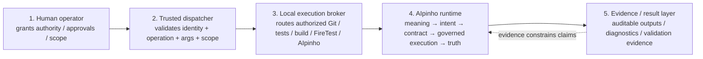
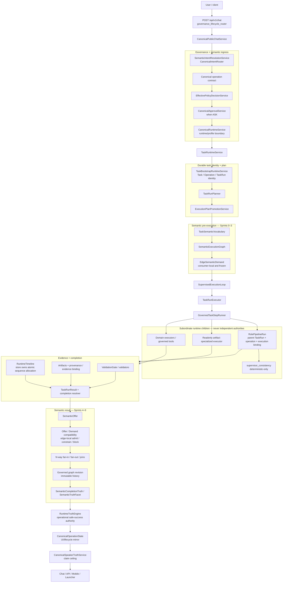
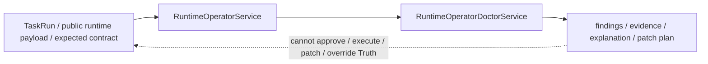

# AIpinho

AIpinho is a governed cognitive/runtime system that turns natural-language intent into observable, policy-bound execution without claiming more than the runtime can prove.

## Current validated status — 2026-09-15

Runtime implementation baseline: `6126a73a9ddfc054fe527174fe4df16740b9d1e0` (`refactor(runtime): consolidate roles and semantic execution`).

- Semantic execution Sprints 0–9 are integrated into the canonical runtime.
- Runtime/roles consolidation is complete and validated.
- Fresh FireTest 5 revalidation reached all six phases: Phase 1 remained truthfully limited; Phases 2–6 completed.
- RuntimeTimeline sequences were contiguous and unique in every phase: **0 gaps / 0 duplicates**.
- Runtime Doctor completed every phase, including the former large-run problem phases.
- The planned `run_role_pipeline` step actually executed in all six TaskRuns.
- Final consolidated regression after reboot: **174 passed / 0 failed**.
- FireTest workspace and corpus mutations: **0 / 0**.
- Known deferred issue: Windows subprocess `cp1252` decode failure in the `.m4a`/media probe reader.

`MODEL != AUTHORITY`. Unknown is fail-closed. Execution completion is not sufficient to claim semantic or product success.

## Five canonical authorities

The dispatcher and broker must remain deliberately dumber than AIpinho: validate → authorize → execute → observe → return. They must not interpret natural language, select semantic intent, invent AIpinho contracts, or become a second orchestration brain.

## Canonical product runtime

### Phase and downstream truth

A producer's completion status alone never authorizes a consumer. `PhaseOutcome` is constrained by canonical `RuntimeTruth`; blocked/contradictory truth blocks downstream admission. A `partial` producer may expose `satisfied_with_limitations` only when the frozen downstream demand and explicit producer `use_safety` are compatible.

Phase 1 of the latest FireTest demonstrates that distinction: it cannot be represented as successful, but its bounded static-analysis evidence can be consumed under explicit limitations. That is not the old Phase 4 contradiction.

## Roles and models

Roles are internal cognitive components of the canonical TaskRuntime, not a sixth authority and not a parallel runtime.

- `RolePipelineService` is invoked as a governed TaskRun step where the selected runtime profile requires it.
- `RolePipelineRun` must bind to the parent TaskRun, operation, and execution.
- `supervisor_consistency` is deterministic-only and cannot gain model authority through a binding.
- `RoleInferenceService` remains a reachable specialized subsystem for bounded model-assisted work; it does not own TaskRun lifecycle or RuntimeTruth.
- the model `speaker` role is wording/generation; `CanonicalSpeakerTruthService` is the claim authority ceiling.
- `semantic_interpreter` may propose semantic structure only behind deterministic gates; it is not prompt-intent authority.

## Compatibility and diagnostic planes

`RuntimeContractsV2Service`, `PlannerV2`, and `RuntimeDispatcherV2` remain compatibility/introspection surfaces and tests. They are not the canonical execution path and must not become a second planner/dispatcher brain.

`IntelligentPlannerService`, `ExecutionGraphService`, and `ContinuousRuntimeService` are still instantiated by `TaskRuntimeService`, but the current code scan found no subsequent `self.*` consumption in the canonical TaskRun path; Genome v2 therefore classifies them as compatibility/inventory until live evidence proves otherwise.

Runtime Doctor is a parallel read-only diagnostic plane:

## Genome 2.0

The previous Genome snapshot dated 2026-07-30 treated file presence as runtime reachability and contained stale/unknown paths. Genome 2.0 was regenerated from the GitHub `main` tree and the same local Git object at `6126a73a…`.

Current inventory includes 2,408 Python modules, 1,214 service modules, 942 schema modules, 1,086 detected API endpoints, 1,018 `test_*.py` files and 3,183 test functions. The GitHub recursive tree contained 18,529 nodes and was not truncated.

Start with:

- `genome/00_manifest.json`
- `genome/reports/genome_summary.md`
- `genome/reports/github_folder_audit_20260915.md`
- `docs/architecture/CURRENT_RUNTIME_MAP_20260915.md`

## Latest evidence

- `reports/runtime_consolidation/runtime_consolidation_final_validation_20260915.md`
- `reports/runtime_consolidation/runtime_consolidation_firetest5_20260915.json`
- raw FireTest evidence is intentionally kept outside the repository quarantine where appropriate.

## Current frontier

The timeline sequence race, RuntimeTruth→PhaseOutcome propagation bug, Doctor large-run timeout, role-step bypass, duplicate readonly runtime lifecycle, and root-role tokenization problem addressed by the consolidation are no longer current P0/P1 items.

The near-term engineering posture is now:

1. evolve semantic/runtime capability on the single canonical TaskRuntime path;
2. keep roles/models subordinate and contract-bound;
3. remove or further demote compatibility surfaces only with evidence-backed migrations;
4. keep Genome/current-state documentation synchronized with implementation and validated evidence;
5. leave the Windows `cp1252/.m4a` reader issue deferred until it becomes part of an explicitly scoped generic media/runtime correction.

## Governing principles

- production code + canonical config/contracts + validated evidence outrank documentation;
- runner/dispatcher logic must not duplicate AIpinho reasoning;
- execution completion != semantic admission;
- Control success != product success;
- producer outcome does not authorize a consumer by status alone;
- SpeakerTruth cannot claim above RuntimeTruth;
- Runtime Doctor diagnoses; it never grants authority;
- FireTest is regression evidence, not runtime configuration.

## Context and handoff

Read `CURRENT_STATE.md`, `DOCUMENT_AUTHORITY.md`, `AIpinho_context_pack/docs/context/00_START_HERE.md`, `AIpinho_context_pack/docs/context/05_RUNTIME_ARCHITECTURE_MAP.md`, and `AIpinho_context_pack/docs/context/current_state.json`.

## M10 current checkpoint — 2026-09-24

M10-B.1 is the current canonical checkpoint at `8fa566c8db9566688fd6dd018da6810c55f739b0`. It closes the diagnosed evidence/context handoff gap without creating a parallel runtime: admitted dependency evidence is materialized into a persisted canonical context plan, bound to child TaskRuns, and consumed consistently by patch planning and role prompts.

The handoff preserves artifact logical paths and provenance, validates required plan/storage identity fail-closed, and deduplicates already-admitted evidence before prompt assembly. Context transport does not grant authority: mission scope, policy, use-safety, approval and RuntimeTruth remain independently governed.

The implementation is promoted to `main`; fresh normal-interface E2E proof is the next validation target. See `CURRENT_STATE.md`, `diagnostic.md`, `e2enewruntimee.md`, and `AIpinho_context_pack/docs/context/current_state.json` for the checkpoint handoff.
