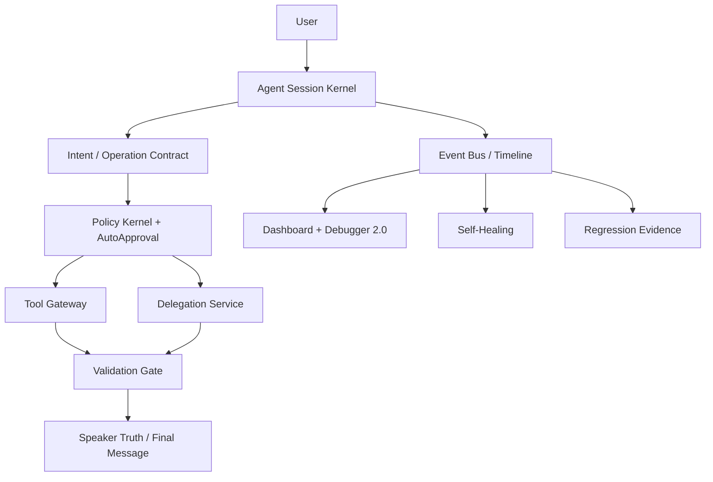

# Final Multi-Agent Architecture

AIpinho RC1 is organized around governed agents rather than unrestricted provider calls.

## Agents

- AIpinho: local primary agent.
- Lucio: multimodal and strategic routing agent.
- Codex: technical executor through governed contracts.
- Gemini: cloud agent with governed delegation and tool boundaries.

## Release Status

- Backend multi-agent kernel: ready with warnings.
- Mobile/Launcher surfaces: implemented, but visual QA must remain part of every release pass.
- Provider integrations: available through separated contracts; real provider smoke is not part of the normal automated suite.

