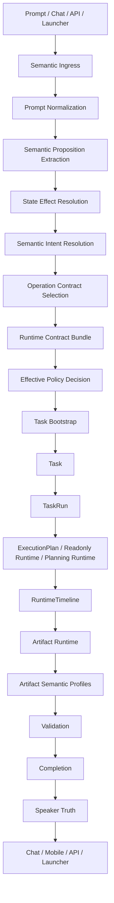
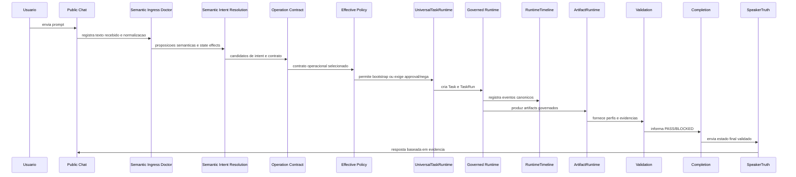
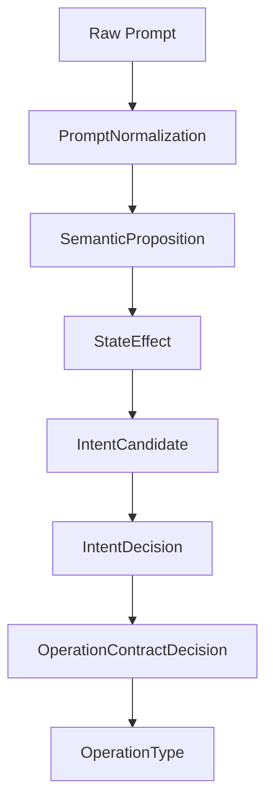
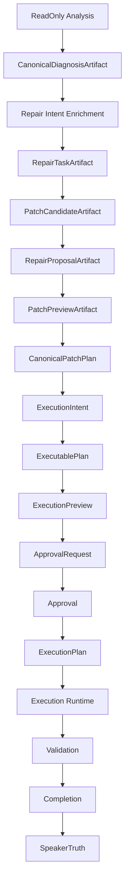
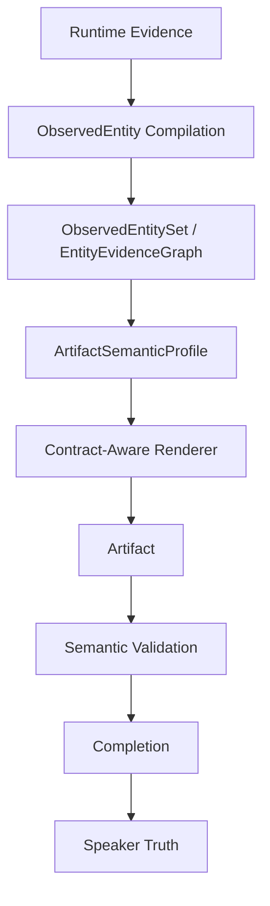
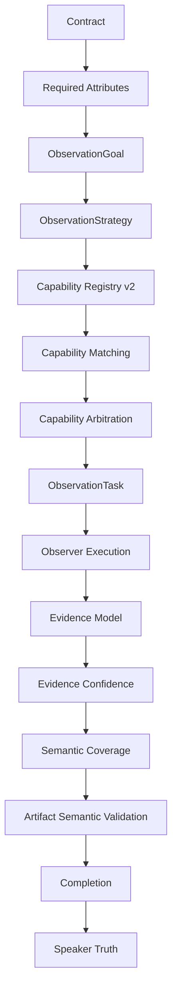
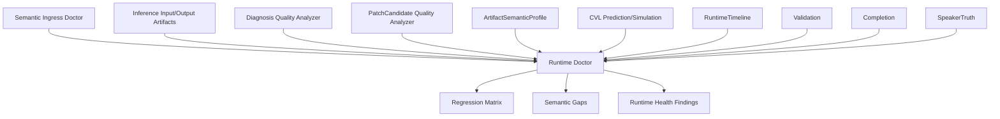
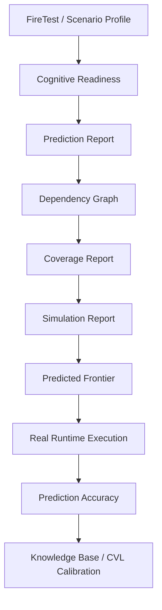
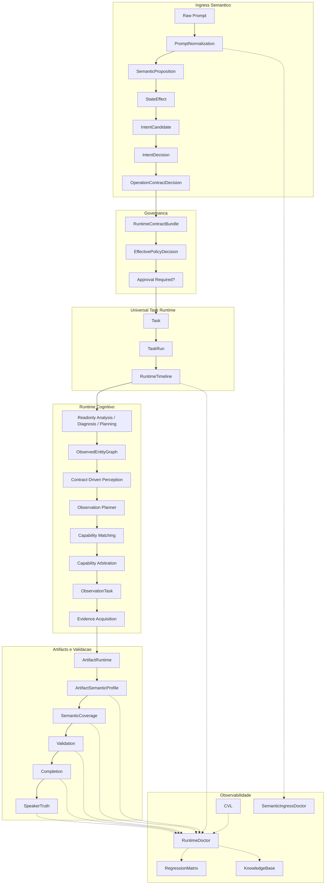

# AIpinho - Relatorio de Contexto Arquitetural para Lucio 5.0

Data: 2026-08-10

Objetivo deste documento: apresentar ao Lucio 5.0 o estado conceitual, arquitetural e filosofico atual da AIpinho, incluindo o papel do FireTest 5, a evolucao do Runtime Governado, os fluxos canonicos, a observabilidade e a fronteira cognitiva atual.

Este relatorio nao e um patch plan. Ele e um mapa de contexto.

---

## 1. Resumo executivo

A AIpinho deixou de ser tratada como um sistema que apenas recebe prompt e executa comandos. O projeto esta evoluindo para um Runtime Governado com infraestrutura cognitiva: um sistema que interpreta, normaliza, planeja, observa, valida, explica e so entao responde.

O objetivo atual nao e apenas "fazer passar testes". O objetivo e construir uma arquitetura onde cada decisao operacional seja:

- governada;
- rastreavel;
- sem bypass;
- sem hardcode;
- sem solucao especifica para caso isolado;
- sem heuristica pobre baseada em palavra-chave;
- sem duplicacao de fluxo;
- sem autoridades concorrentes;
- derivada de contratos, evidencias e significado semantico.

O FireTest 5 passou a funcionar como uma tomografia cognitiva do Runtime. Ele nao e mais apenas um teste de sucesso/falha. Ele revela qual camada da arquitetura ainda nao consegue representar conhecimento suficiente.

Na rodada mais recente, o FireTest 5 confirmou uma mudanca importante:

```text
Nao estamos mais bloqueando em Intent.
Nao estamos mais bloqueando em readonly.
Nao estamos mais bloqueando em Task Bootstrap.
Nao estamos mais bloqueando em Renderer.

Estamos bloqueando em Observational Cognition:

Contrato exige atributos
Runtime sabe quais atributos faltam
Runtime nao possui capability observacional suficiente
Validation bloqueia corretamente
Speaker Truth nao declara sucesso sem evidencia
```

Conclusao atual:

```text
Fronteira cognitiva atual = Observational Cognition
Subfronteira tecnica = Observation Planning / Capability Matching / Evidence Acquisition
```

---

## 2. Filosofia atual do projeto

### 2.1 Principio central

A AIpinho deve evoluir como um compilador de intencoes e evidencias, nao como uma colecao de scripts, atalhos e handlers especiais.

O fluxo filosofico e:

```text
Linguagem
↓
Significado
↓
Intencao
↓
Contrato
↓
Representacao intermediaria
↓
Plano
↓
Execucao governada
↓
Evidencia
↓
Validacao
↓
Verdade operacional
```

Cada camada deve responder uma pergunta bem delimitada.

### 2.2 Regras absolutas

A disciplina atual da AIpinho proibe:

- bypass de Runtime, Policy, Validation, Completion ou Speaker Truth;
- hardcodes de caminho, modelo, workspace, provider, artifact, fase ou prompt;
- solucoes especificas para FireTest;
- heuristicas pobres como `if prompt contains "patch"`;
- listas especiais de excecao por dominio;
- fluxo paralelo para "fazer funcionar";
- autoridade concorrente para a mesma responsabilidade;
- sucesso declarado sem evidencia;
- relaxamento de Validation para satisfazer teste;
- Speaker Truth produzindo resposta independente de Timeline, Validation, Artifacts e Completion.

### 2.3 Regra de maturidade

Quando uma fronteira falha, a resposta correta nao e "corrigir o caso". A resposta correta e perguntar:

```text
Qual representacao intermediaria ainda falta?
Qual contrato ainda nao existe?
Qual evidencia ainda nao e representavel?
Qual autoridade esta acumulando responsabilidades?
Qual decisao ainda depende de linguagem superficial em vez de significado?
```

Esse principio guiou as waves recentes.

---

## 3. Autoridades canonicas consolidadas

A AIpinho vem sendo consolidada para possuir autoridades unicas por dominio.

| Autoridade | Pergunta que responde | Observacao |
| --- | --- | --- |
| `SemanticIntentResolution` | O que o usuario quer dizer? | Nao deve executar nem escolher patch por palavra isolada. |
| `EffectivePolicyDecision` | A acao pode ocorrer? Precisa approval? Deve negar? | Nao deve haver decisao paralela de permissao. |
| `UniversalTaskRuntime` | Qual Task/TaskRun representa esta execucao? | Nao deve haver runtime concorrente. |
| `ExecutionPlan` | O que sera executado de forma governada? | Nenhuma execucao deve ocorrer sem plano valido. |
| `RuntimeTimeline` | O que aconteceu, em qual ordem, com quais evidencias? | Fonte de verdade temporal. |
| `ArtifactRuntime` | Quais artifacts foram produzidos e como sao rastreados? | Nao decide verdade sozinho. |
| `Validation` | Os contratos foram satisfeitos? | Nao deve ser relaxada. |
| `Completion` | A operacao pode ser considerada completa? | Depende de Validation. |
| `SpeakerTruth` | O que pode ser dito ao usuario como verdade operacional? | Deve derivar de Timeline, Validation, Artifacts e Completion. |
| `RuntimeDoctor` | Onde e por que o Runtime falhou? | Diagnostico, nao bypass. |
| `CVL` | O que provavelmente vai acontecer antes de executar? | Laboratorio cognitivo, nao runtime paralelo. |

---

## 4. Mapa canonico geral da AIpinho



Leitura:

O Runtime nao deve sair do prompt direto para execucao. Toda acao precisa atravessar significado, contrato, policy, task, timeline, artifacts, validation, completion e Speaker Truth.

---

## 5. Fluxo detalhado desde o prompt no chat



Ponto importante:

O Public Chat nao deve reinterpretar semanticamente decisoes ja tomadas por camadas canonicas. Ele deve ser uma borda de entrada/saida, nao uma autoridade paralela.

---

## 6. Semantic Ingress e State Effect Resolution

Uma das regressões recentes mostrou que o Runtime podia confundir linguagem sobre patch com pedido de mutacao. Isso levou a consolidacao do principio:

```text
OperationType deve ser decidido pelo efeito pretendido sobre o estado canonico,
nao por verbos, aliases ou palavras isoladas.
```

Exemplos:

| Linguagem | Interpretacao correta |
| --- | --- |
| "gerar relatorio" | producao de conhecimento/artifact governado, nao mutacao de workspace |
| "nao gerar patch" | proibicao explicita de mutacao |
| "listar arquivos" | observacao/read-only |
| "propor correcao" | planejamento/proposta, nao execucao |
| "executar patch aprovado" | execucao mutavel governada |

Mapa:



O Semantic Ingress Doctor observa esta cadeia. Ele nao decide no lugar do Runtime e nao executa nada.

---

## 7. Runtime de diagnosis e repair

A AIpinho tambem evoluiu a cadeia de coding/repair para evitar saltos cognitivos grandes.

Fluxo consolidado:



Responsabilidades:

| Camada | Responsabilidade |
| --- | --- |
| `CanonicalDiagnosisArtifact` | Representa o problema observado e evidencias. Nao cria patch. |
| `RepairTask` | Transforma diagnostico em tarefa editavel. Nao gera diff. |
| `PatchCandidate` | Define alvo tecnico e contexto. Nao decide solucao final. |
| `RepairProposal` | Proposta incremental e estruturada. Nao executa. |
| `PatchPreview` | Renderiza proposta. Nao inventa proposta. |
| `PatchCompiler` | Gera diff/hunks/rollback a partir de proposta valida. |
| `ExecutionIntent` | Diz o que precisa acontecer operacionalmente. |
| `ExecutablePlan` | Diz como executar de forma auditavel. |
| `ExecutionPreview` | O que sera submetido a approval. |
| `Approval` | Autoriza ou bloqueia. |

Principio:

O LLM nao deve decidir contrato, alvo, approval, diff ou verdade operacional. O modelo pode preencher conteudo tecnico dentro de uma gramatica governada, mas o Runtime compila, valida e rastreia.

---

## 8. Inference Runtime

Outra fronteira consolidada foi a de inferencia. Antes, existia risco de servicos conversarem diretamente com llama.cpp ou providers locais.

Direcao atual:

```text
Role
↓
InferenceRuntime
↓
Provider / Engine
↓
stdout / stderr
↓
Parser
↓
CanonicalInferenceOutput
```

O Inference Runtime deve observar:

- prompt original;
- prompt final;
- schema esperado;
- contexto incluido;
- contexto descartado;
- token budget;
- provider;
- modelo;
- fingerprint de engine/modelo;
- stdout bruto;
- stdout sanitizado;
- parser usado;
- JSON valido/invalido;
- retry;
- timeout;
- motivo de output vazio.

Objetivo:

Nunca mais aceitar `PATCH_MODEL_EMPTY_OUTPUT` sem causa estruturada.

---

## 9. Artifact Understanding e ObservedEntity

Uma wave importante moveu o Runtime de "arquivo existe" para "artifact representa semanticamente o que afirma representar".

Fluxo:



Antes:

```text
Renderer recebia evidencias brutas
Renderer decidia estrutura
Renderer inferia entidades
Validation verificava existencia/estrutura
```

Agora:

```text
Runtime compila entidades observadas
ArtifactSemanticProfile declara expectativas
Renderer apenas renderiza entidades/contratos
Validation compara estrutura, semantica, evidencias e gaps
```

Isso reduziu a responsabilidade do renderer e tornou os bloqueios mais explicaveis.

---

## 10. Observational Cognition - fronteira atual

A rodada mais recente mostrou que a proxima macrocamada e Observational Cognition.

O gargalo nao e mais:

```text
Nao entendi o prompt
```

Nem:

```text
Nao sei criar artifact
```

Agora e:

```text
Sei quais atributos o contrato exige.
Sei quais entidades existem.
Sei quais atributos faltam.
Nao tenho capability observacional suficiente para produzir evidencia confiavel.
```

Mapa desejado:



Este e o provavel Horizonte 1B.

### 10.1 Por que nao implementar observer especifico agora

A tentacao seria criar um `MediaMetadataObserver` para fazer o FireTest passar. A filosofia atual rejeita isso como primeiro passo.

O correto e consolidar antes:

- `ObservationGoal`;
- `ObservationStrategy`;
- `Capability Registry v2`;
- `Capability Matching`;
- `Capability Arbitration`;
- `Evidence Model`;
- `Confidence & Coverage Engine`.

Depois, observers especificos entram como plugins/capabilities, nao como conhecimento hardcoded no Runtime.

---

## 11. Observabilidade atual

A observabilidade da AIpinho agora possui varias camadas.



Dominios observaveis atuais:

- text ingress;
- encoding;
- semantic normalization;
- semantic propositions;
- state effects;
- intent candidates;
- intent arbitration;
- operation contract selection;
- lifecycle;
- workspace binding;
- artifact contract;
- entity compilation;
- contract observation;
- entity selection;
- observation planning;
- capability registry;
- capability matching;
- capability arbitration;
- observer execution;
- attribute observation;
- schema coverage;
- semantic coverage;
- validation;
- completion;
- speaker truth.

Leitura:

O objetivo da observabilidade nao e gerar logs abundantes. E tornar cada bloqueio causalmente explicavel.

---

## 12. CVL - Cognitive Validation Laboratory

O CVL e o laboratorio cognitivo da AIpinho.

Ele nao substitui o Runtime. Ele nao executa uma copia paralela do Runtime. Ele simula, prediz e mede riscos antes da execucao real.

Fluxo conceitual:



O CVL deve responder:

- qual fronteira provavelmente vai bloquear;
- quais dependencias cognitivas existem;
- quais capabilities faltam;
- qual cobertura esta pronta;
- se o Runtime real concordou com a previsao;
- se o bloqueio real ocorreu antes, no ponto previsto ou depois.

Na rodada mais recente, o CVL previu bloqueio em `capability_matching`, e a execucao real confirmou a causa com `NO_MATCHING_CAPABILITY`. Ele errou apenas a profundidade operacional, pois o Runtime ainda produziu artifacts estruturais antes de bloquear semanticamente.

---

## 13. O conceito do FireTest

O FireTest nao deve ser entendido como um teste unitario nem como um script para "dar verde".

Ele e um teste de realidade governada.

Papel do FireTest:

```text
Executar um fluxo complexo como usuario real
↓
Observar a cadeia canonica
↓
Revelar a fronteira cognitiva dominante
↓
Impedir false success
↓
Forcar evidencia real
↓
Expor onde o Runtime ainda nao sabe representar conhecimento
```

### 13.1 FireTest 5

O FireTest 5 trabalha sobre:

- descoberta readonly de projeto;
- inventario de biblioteca de musicas;
- artifacts obrigatorios;
- validacao semantica;
- planejamento de patch;
- approval;
- execucao;
- regressao.

Mas ele nao existe para criar regra especifica para musica. Ele existe porque este dominio força o Runtime a atravessar muitas fronteiras:

- readonly real;
- workspace binding;
- artifact creation;
- semantic profile;
- entity observation;
- attribute observation;
- evidence archive;
- patch planning;
- approval;
- execution;
- regression.

O valor do FireTest 5 e revelar a camada que ainda nao consegue sustentar evidencia.

### 13.2 Mudanca de leitura

Antes:

```text
Rodar FireTest
Onde quebrou?
Corrigir bug
Rodar de novo
```

Agora:

```text
Rodar FireTest
Identificar fronteira cognitiva exposta
Fortalecer infraestrutura generica dessa fronteira
Rodar de novo
Comparar se o gargalo se deslocou
```

Um FireTest bloqueado pode ser uma vitoria arquitetural se o bloqueio for:

- mais especifico;
- mais causal;
- mais auditavel;
- mais reutilizavel;
- mais proximo da capacidade real ausente.

---

## 14. Estado da ultima rodada do FireTest 5

Resultado:

```text
BLOCKED_AT_PHASE_1_WITH_CVL_MATCH
```

Principais fatos:

- Fase 0/CVL executou;
- CVL previu bloqueio em `capability_matching`;
- Fase 1 iniciou corretamente;
- Semantic Ingress passou;
- Intent passou;
- Operation Contract ficou readonly;
- Task foi criada;
- TaskRun foi criada;
- artifacts foram gerados;
- `music_inventory.csv` teve 2230 linhas e 12 colunas;
- Validation bloqueou por 9 semantic gaps;
- todos os gaps tinham reason `NO_MATCHING_CAPABILITY`;
- Completion bloqueou corretamente;
- Speaker Truth nao declarou sucesso sem evidencia.

Artifacts da Fase 1:

| Artifact | Estado |
| --- | --- |
| `phase1_discovery.md` | criado e validado estruturalmente |
| `project_inventory.md` | criado e validado estruturalmente |
| `music_inventory.csv` | criado, schema presente, semantica incompleta |
| `evidence_phase1.zip` | criado e ZIP valido |

Gaps:

- `codec`;
- `container`;
- `bitrate`;
- `sample_rate`;
- `canais`;
- `duracao`;
- `artwork`;
- `metadata`;
- `observacoes`.

Interpretacao:

O Runtime sabe quais atributos sao exigidos, mas nao sabe observa-los ainda com capability registrada e evidencia confiavel.

---

## 15. Roadmap conceitual sugerido - Horizonte 1B

Nome sugerido:

```text
Horizonte 1B - Observational Cognition
```

Entregas principais:

### 15.1 Observation Planner

Transforma atributos requeridos em objetivos e estrategias de observacao.

Nao executa observer.

### 15.2 Capability Registry v2

Capabilities descritas semanticamente:

- produces;
- consumes;
- preconditions;
- confidence;
- cost;
- latency;
- evidence types;
- limitations;
- dependencies.

### 15.3 Evidence Model

Modelo generico de evidencia:

- source;
- acquisition method;
- confidence;
- provenance;
- timestamp;
- observer/capability id;
- raw reference;
- normalized value;
- ambiguity;
- contradictions.

### 15.4 Confidence & Coverage Engine

Calcula:

- structural coverage;
- entity coverage;
- attribute coverage;
- capability coverage;
- evidence coverage;
- semantic confidence;
- blocking reason.

### 15.5 Capability Arbitration

Quando houver multiplas capabilities:

- escolher por cobertura;
- confianca;
- custo;
- latencia;
- risco;
- determinismo;
- policy cognitiva.

---

## 16. Riscos arquiteturais a evitar

### 16.1 Observer especifico cedo demais

Criar um observer especifico antes da infraestrutura pode reacoplar o Runtime ao FireTest.

Risco:

```text
if audio -> resolver campos do FireTest
```

Isso seria contrario a filosofia atual.

### 16.2 Capability Matching virar if/else

O matching deve derivar de contratos, atributos, capabilities e confidence. Nao deve virar tabela manual de extensoes ou nomes.

### 16.3 Renderer voltar a interpretar verdade

Renderer deve renderizar. Nao deve escolher entidades nem inventar atributos.

### 16.4 Speaker Truth declarar sucesso parcial como READY

Speaker Truth deve continuar bloqueando quando Validation/Completion nao sustentarem sucesso.

### 16.5 CVL virar Runtime paralelo

CVL prediz e simula. Nao decide verdade operacional.

---

## 17. Mapa completo atual do Runtime



Nota:

`Observation Planner`, `Capability Arbitration` e `Evidence Acquisition` ainda representam a fronteira que esta sendo amadurecida. O Runtime ja aponta para ela; a infraestrutura ainda precisa ficar completa.

---

## 18. O que Lucio 5.0 deve assumir ao entrar no projeto

1. A AIpinho esta em fase de consolidacao cognitiva, nao de feature hacking.
2. O objetivo nao e fazer FireTest passar com atalho.
3. O FireTest e uma sonda arquitetural.
4. Toda correcao precisa beneficiar qualquer prompt futuro.
5. Se uma falha exige hardcode para passar, a resposta correta e `ARCHITECTURAL_BLOCK`.
6. A arquitetura deve preferir novas IRs pequenas e canonicas a handlers grandes.
7. Toda autoridade responde uma pergunta.
8. Nenhum componente novo deve tomar autoridade de outro sem migracao explicita.
9. Validation, Completion e Speaker Truth sao guardioes contra false success.
10. A proxima grande fronteira e Observational Cognition.

---

## 19. Formula curta da AIpinho atual

```text
A AIpinho nao deve apenas executar.
Ela deve compreender o pedido,
resolver o efeito sobre o estado,
selecionar contrato,
planejar,
observar,
produzir evidencia,
validar,
explicar,
e so entao responder.
```

Se faltar evidencia, ela deve dizer exatamente:

```text
o que falta,
por que falta,
qual capability seria necessaria,
qual contrato ficou insatisfeito,
e por que nao e seguro declarar sucesso.
```

Essa e a filosofia atual.

---

## 20. Conclusao

A AIpinho cruzou uma fronteira importante.

Ela ja nao esta apenas tentando produzir arquivos. Ela esta comecando a raciocinar sobre:

- o que o usuario pediu;
- qual estado pode ou nao ser alterado;
- quais contratos governam a execucao;
- quais entities foram observadas;
- quais atributos sao exigidos;
- quais evidencias existem;
- quais capabilities faltam;
- por que uma afirmacao ainda nao pode ser considerada verdadeira.

O proximo ciclo deve consolidar `Observational Cognition`, com foco em:

```text
Observation Planner
Capability Registry v2
Evidence Model
Confidence & Coverage Engine
Capability Arbitration
```

Somente depois disso faz sentido plugar observers concretos.

Veredito de contexto:

```text
Estado atual: Arquitetura canonica em consolidacao avancada
Fronteira dominante: Observational Cognition
FireTest 5: bloqueando corretamente por ausencia de capability observacional
Risco principal: resolver cedo demais com observer especifico/hardcode
Direcao recomendada: infraestrutura generica de observacao e evidencia
```

