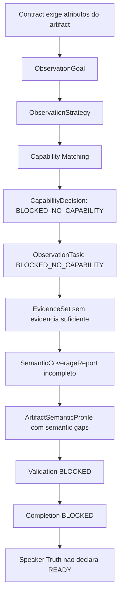

# FireTest 5 - Reexecucao limpa pos-Observational Cognition Foundation

Gerado em: 2026-08-10T18:52:24

## Veredito

**Resultado da rodada:** `BLOCKED_AT_PHASE_1_WITH_CVL_MATCH`.

A execucao foi limpa, iniciou pela Fase 0/CVL, executou a Fase 1 pelo endpoint publico `/api/v1/chat`, criou Task e TaskRun, gerou artifacts reais e bloqueou corretamente porque a Validation nao encontrou evidencia semantica suficiente para o `music_inventory.csv`.

A rodada **nao prosseguiu para as Fases 2-6** porque o Success Contract da Fase 1 exige `Validation PASS` e `Speaker Truth PASS`; ambos bloquearam corretamente.

## IDs da execucao

| Item | Valor |
|---|---|
| Task | `task_8eedbf1fa82c4b67b58275fc5f101c9f` |
| TaskRun | `task_run_9085451480b34feea2cedaee6dcfb6c4` |
| Operation | `chatop_9085451480b34feea2cedaee6dcfb6c4` |
| Operation Type | `workspace_analysis_readonly` |
| Status publico | `blocked` |
| Validation | `blocked` |
| Completion | `blocked` |
| Artifacts diretos | `4` |

## Fase 0 / CVL

O CVL executou e previu corretamente a fronteira cognitiva dominante:

| Campo | Valor |
|---|---|
| Status CVL | `blocked` |
| Componente previsto | `capability_matching` |
| Reason code previsto | `PREDICTED_CAPABILITY_MISSING` |
| Confianca | `0.9` |
| Hipotese | A required cognitive or observational capability is not declared as available. |

Arquivos da Fase 0 materializados:

- `C:\Dev\AIpinho\reports\firetest5\phase0_cognitive_readiness.md`
- `C:\Dev\AIpinho\reports\firetest5\phase0_prediction.md`
- `C:\Dev\AIpinho\reports\firetest5\phase0_dependency_graph.md`
- `C:\Dev\AIpinho\reports\firetest5\phase0_coverage.md`
- `C:\Dev\AIpinho\reports\firetest5\phase0_simulation.md`
- `C:\Dev\AIpinho\reports\firetest5\phase0_frontier.md`
- `C:\Dev\AIpinho\reports\firetest5\phase0_result.json`

## Pre-Task Bootstrap e Semantic Ingress

A cadeia pre-task foi observada completa:

| Etapa | Status | Razao |
|---|---|---|
| `ChatIngressReceived` | `complete` | `prompt_received` |
| `PromptNormalized` | `complete` | `prompt_normalized` |
| `PreviewStarted` | `complete` | `canonical_lifecycle_preview_started` |
| `IntentResolutionStarted` | `complete` | `canonical_intent_resolution_started` |
| `IntentResolutionFinished` | `complete` | `canonical_intent_resolved` |
| `OperationContractSelected` | `complete` | `operation_contract_selected` |
| `TaskBootstrapStarted` | `complete` | `task_bootstrap_required` |
| `TaskBootstrapFinished` | `complete` | `task_bootstrap_finished` |
| `TaskCreated` | `complete` | `task_created` |
| `TaskRunCreated` | `complete` | `task_run_created` |

Decisao semantica:

| Item | Valor |
|---|---|
| Intent selecionado | `workspace_analysis_readonly` |
| Operation selecionada | `workspace_analysis_readonly` |
| Contrato selecionado | `analysis_readonly` |
| Relacao com State Effects | `aligned` |
| State effect principal no trace | `knowledge_only` |

Conclusao: a regressao antiga de `patch_request` nao reapareceu. O prompt foi interpretado como readonly/knowledge-only, e o contrato permaneceu `analysis_readonly`.

## Artifacts produzidos

| Artifact | ID | Tipo | Bytes |
|---|---|---|---|
| `reports/firetest5/phase1_discovery.md` | `artifact_fc9d5e1d0a504ab2bf67509a8ae1b9b2` | `text/markdown` | `8644` |
| `reports/firetest5/project_inventory.md` | `artifact_4efe5561f3f34c3fa8dea22bdd27efc6` | `text/markdown` | `8645` |
| `reports/firetest5/music_inventory.csv` | `artifact_63235e7778c24bc5aaa8f82a9a50716f` | `text/csv` | `101754` |
| `reports/firetest5/evidence_phase1.zip` | `artifact_dfd26e81eb494524bae5c27c1862025f` | `application/zip` | `155114` |

Resumo fisico dos artifacts:

| Item | Valor |
|---|---|
| CSV linhas de dados | `2272` |
| CSV colunas | `12` |
| ZIP bytes | `155114` |
| ZIP entradas | `3` |
| Entradas ZIP | `manifest.json, analysis.json, dependencies.json` |

## CSV: estrutura valida, semantica incompleta

O `music_inventory.csv` tem schema estrutural esperado, mas os atributos exigidos pelo contrato nao foram observados com evidencia suficiente.

| Coluna | Valores preenchidos | Valores vazios |
|---|---:|---:|
| `nome` | `2272` | `0` |
| `extens?o` | `0` | `2272` |
| `tamanho` | `2272` | `0` |
| `codec` | `0` | `2272` |
| `container` | `0` | `2272` |
| `bitrate` | `0` | `2272` |
| `sample_rate` | `0` | `2272` |
| `canais` | `0` | `2272` |
| `dura??o` | `0` | `2272` |
| `artwork` | `0` | `2272` |
| `metadata` | `0` | `2272` |
| `observa??es` | `0` | `2272` |

A estrutura existe, mas quase todo atributo musical semantico ficou vazio. Isso confirmou que a Validation estava correta em bloquear: arquivo existir e coluna existir nao significa contrato semantico satisfeito.

## Observational Cognition: cadeia causal observada

Contagem unica de IRs encontradas na TaskRun:

| IR | Quantidade unica |
|---|---:|
| ObservationGoal | `12` |
| ObservationStrategy | `62` |
| CapabilityMatch | `2` |
| CapabilityDecision | `12` |
| ObservationTask | `12` |
| EvidenceSet | `1` |
| SemanticCoverageReport | `1` |
| ArtifactSemanticProfile | `4` |
| SemanticGap signatures | `10` |

Estados observados:

| Dimensao | Distribuicao observada |
|---|---|
| CapabilityDecision | `{"selected": 26, "no_matching_capability": 130}` |
| CapabilityMatch | `{"MATCHED": 26}` |
| ObservationTask | `{"READY_FOR_OBSERVER": 26, "BLOCKED_NO_CAPABILITY": 130}` |

A cadeia causal principal ficou assim:

## Semantic gaps

| Gap | Ocorrencias no JSON | Reason code |
|---|---:|---|
| `ATTRIBUTE_NOT_OBSERVED:extens?o` | `31` | `NO_MATCHING_CAPABILITY` |
| `ATTRIBUTE_NOT_OBSERVED:codec` | `31` | `NO_MATCHING_CAPABILITY` |
| `ATTRIBUTE_NOT_OBSERVED:container` | `31` | `NO_MATCHING_CAPABILITY` |
| `ATTRIBUTE_NOT_OBSERVED:bitrate` | `31` | `NO_MATCHING_CAPABILITY` |
| `ATTRIBUTE_NOT_OBSERVED:sample_rate` | `31` | `NO_MATCHING_CAPABILITY` |
| `ATTRIBUTE_NOT_OBSERVED:canais` | `31` | `NO_MATCHING_CAPABILITY` |
| `ATTRIBUTE_NOT_OBSERVED:dura??o` | `31` | `NO_MATCHING_CAPABILITY` |
| `ATTRIBUTE_NOT_OBSERVED:artwork` | `31` | `NO_MATCHING_CAPABILITY` |
| `ATTRIBUTE_NOT_OBSERVED:metadata` | `31` | `NO_MATCHING_CAPABILITY` |
| `ATTRIBUTE_NOT_OBSERVED:observa??es` | `31` | `NO_MATCHING_CAPABILITY` |

Todos os gaps relevantes carregaram:

- `reason_code = NO_MATCHING_CAPABILITY`
- `perception_domain = observer_capability`
- `reason_chain = ATTRIBUTE_NOT_OBSERVED -> OBSERVER_CAPABILITY_MISSING -> NO_MATCHING_CAPABILITY`
- `candidate_entity_count = 2286`
- `selected_entity_count = 2272`
- `observer_capability_ids = []`
- recomendacao generica: registrar capability que satisfa?a a estrategia observacional exigida pelo atributo.

## Novo achado: selecao/especializacao de entidades ainda ampla demais

A observacao do Rafael se confirmou pelos dados do CSV. O inventario mistura arquivos do projeto, dependencias/build e musicas da biblioteca.

Pelo nome do arquivo no CSV:

| Classificacao aproximada | Quantidade |
|---|---:|
| Audio-like por extensao no nome | `928` |
| Nao audio ou desconhecido | `1344` |
| Sem sufixo | `41` |
| Total | `2272` |

Top extensoes/sufixos inferidos do campo `nome`:

| Sufixo | Quantidade |
|---|---:|
| `.m4a` | `921` |
| `.class` | `244` |
| `.dll` | `244` |
| `.jar` | `138` |
| `.lrc` | `121` |
| `.len` | `72` |
| `.h` | `64` |
| `.kt` | `46` |
| `.lib` | `41` |
| `.md` | `34` |
| `.exe` | `27` |
| `.tab` | `26` |
| `.keystream` | `24` |
| `.at` | `24` |
| `.tab_i` | `24` |
| `.xsd` | `19` |
| `.properties` | `18` |
| `.config` | `16` |
| `.bin` | `15` |
| `.txt` | `11` |

Amostras nao musicais no `music_inventory.csv`:

`.gitignore, build.gradle.kts, codexrelatorio.txt, compose-desktop.pro, gradle.properties, gradlew, gradlew.bat, README.md, settings.gradle.kts, file-system.probe, gc.properties, checksums.lock, md5-checksums.bin, sha1-checksums.bin, gc.properties, executionHistory.bin, executionHistory.lock, expanded.lock, last-build.bin, fileHashes.bin`

Amostras musicais no `music_inventory.csv`:

`505 - 2.m4a, 505.m4a, A Certain Romance.m4a, A Day To Remember - All I Want.m4a, A Day To Remember - I'm Made of Wax, Larry, What Are You Made Of Official Vide.m4a, A Day To Remember - If it means a lot to you.m4a, A Dozen Roses.m4a, A Fantastica Vida De Romantica.m4a, A Little Death.m4a, A Pearl - 2.m4a`

Conclusao: alem da falta de observer/capability para atributos como `codec` e `bitrate`, existe uma subfronteira anterior: **Entity Specialization / Contract-Relevant Entity Filtering**. A AIpinho ainda seleciona `file` como entidade generica e nao diferencia suficientemente a entidade que satisfaz o contrato de inventario musical daquela que apenas existe no workspace/projeto.

Importante: isso nao deve ser corrigido com lista de extensoes hardcoded. O caminho coerente e fazer a especializacao nascer de contrato, entidade, evidencia e capabilities declarativas.

## Comparacao CVL vs Runtime real

| Aspecto | CVL previu | Runtime real | Leitura |
|---|---|---|---|
| Ingress/Intent | passaria | passou | correto |
| Operation Contract | readonly/analysis | readonly/analysis | correto |
| Task/TaskRun | deveria nascer | nasceu | correto |
| Fronteira cognitiva | capability_matching | semantic gaps com `NO_MATCHING_CAPABILITY` | match causal |
| Validation | bloquearia como consequencia | bloqueou | correto |
| Speaker Truth | nao deveria declarar sucesso | nao declarou | correto |

O CVL acertou a fronteira em termos cognitivos. Operacionalmente, o bloqueio aparece em Validation/Completion, mas a causa registrada dentro do ArtifactSemanticProfile aponta para `capability_matching` / `observer_capability`.

## Runtime Doctor

Foi gerado snapshot e analise read-only:

- Snapshot: `C:\Dev\AIpinho\reports\firetest5\runtime_operator_snapshot_phase1.json`
- Doctor: `C:\Dev\AIpinho\reports\firetest5\runtime_doctor_phase1_current.json`

Resultado do Doctor atual:

| Campo | Valor |
|---|---|
| Status HTTP | `200` |
| Report status | `regressions_found` |
| Summary | `{"status": "FAIL", "pass_count": 2, "warn_count": 0, "fail_count": 4, "not_applicable_count": 12, "highest_severity": "high"}` |

Observacao importante: o Runtime Doctor RD4 marcou algumas regress?es aparentes (`Intent`, `Artifacts`, `Validation`, `SpeakerTruth`) por comparar formatos resumidos/achatados do snapshot com expectativas estruturadas. A evidencia detalhada do `governance_lifecycle` mostra Intent correto e Speaker Truth corretamente bloqueado. Portanto, a proxima melhoria do Doctor nao e relaxar regra; e fazer o Doctor consumir melhor Semantic Ingress, ArtifactSemanticProfile e Observational IR para separar **bloqueio esperado** de **regressao real**.

## Achados principais

1. **Renderer nao e mais o gargalo principal.** Ele produziu o artifact estrutural com colunas corretas e ZIP real.
2. **Validation esta correta.** Bloqueou porque schema estrutural nao basta; faltou evidencia semantica para atributos do contrato.
3. **CVL acertou a fronteira cognitiva.** Previu capability matching e a execucao real produziu gaps `NO_MATCHING_CAPABILITY`.
4. **A fundacao de Observational Cognition apareceu no Runtime real.** Goals, Strategies, Decisions, Tasks, EvidenceSet e CoverageReport existem na TaskRun.
5. **CapabilityMatch negativo ainda nao existe como objeto auditavel.** Existem matches positivos (`MATCHED`) para atributos ja presentes (`nome/name`, `tamanho/size_bytes`), mas os casos sem capability aparecem como `CapabilityDecision` + `ObservationTask` bloqueados, com `capability_match_ids=[]`. A recomendacao do Lucio se confirmou como ajuste arquitetural pequeno e importante.
6. **Entity specialization esta ampla demais.** O inventario inclui 2272 linhas; apenas 928 parecem audio-like por sufixo de nome, enquanto 1344 sao nao audio/desconhecidas. O contrato pedia musicas da biblioteca, mas a entidade selecionada ainda mistura projeto, build, dependencias e biblioteca.
7. **Encoding observability ainda tem lacuna.** O Semantic Ingress registrou `encoding_issues=[]`, mas labels aparecem como `extens?o`, `dura??o`, `m?sicas`. Isso nao causou sozinho o bloqueio, mas deveria gerar um warning de degradacao/replacement character.

## Proxima fronteira cognitiva

Em uma frase:

**A principal fronteira atual e Entity Specialization orientada por contrato, seguida por Capability Matching negativo auditavel e capabilities observacionais reais.**

Nao e hora de hardcode para musica. O caminho recomendado e:

1. Criar `CapabilityMatch` negativo explicito para tentativas sem capability, preservando `goal_id`, `strategy_id`, atributo, entidade e motivo.
2. Evoluir Entity Selection/Specialization para separar entidade generica `file` de entidade candidata ao papel declarado pelo contrato, sem listas fixas por extensao.
3. Ensinar o Runtime a expressar quando a entidade selecionada e ampla demais para o contrato: `ENTITY_SPECIALIZATION_INSUFFICIENT` ou equivalente.
4. Corrigir observabilidade de encoding para detectar caracteres substituidos (`?`) em prompt, schema e labels.
5. So depois catalogar/plugar observers concretos como capabilities declarativas. Um observer de metadata de midia deve entrar como capability futura, nao como regra do FireTest.

## Status final da rodada

`READY_WITH_FINDINGS`

A rodada foi realizada, nao houve correcao de codigo durante a execucao, o CVL foi comparado com o Runtime real, a nova fronteira cognitiva foi identificada, e o bloqueio ficou mais causal e auditavel do que antes. O FireTest 5 nao prosseguiu alem da Fase 1 porque a Validation bloqueou corretamente.
