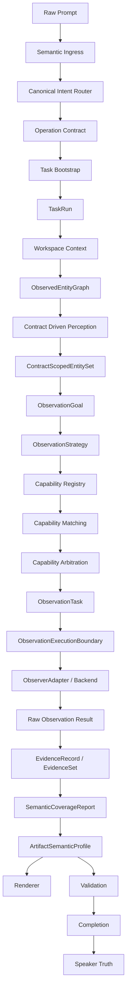

# AIpinho - Relatório Consolidado para Lúcio 5.0

Data: 2026-08-11  
Escopo: últimas waves de Horizonte 1B, H1C.1 e último FireTest 5 limpo  
Veredito da última execução: `BLOCKED_AT_PHASE_1_WITH_CVL_MATCH`

## 1. Resumo Executivo

A rodada mais recente confirma um avanço arquitetural importante da AIpinho.

O FireTest 5 não ficou verde, e isso é correto. Ele bloqueou na Fase 1 porque ainda não existe capability/backend observacional real disponível no runtime atual para produzir evidência de metadata de mídia. O ponto importante é que o bloqueio agora é causal, previsto pelo CVL e sustentado por Validation, Completion e Speaker Truth.

Resultado central:

```text
Fase 0 / CVL
-> previu bloqueio em capability_matching / media_metadata_reader

Fase 1 / Runtime público
-> criou Task e TaskRun naturalmente
-> manteve operação readonly
-> separou project_root e library_root
-> gerou artifacts obrigatórios
-> selecionou entidades do corpus/library
-> derivou extensão por capacidade genérica de arquivo
-> bloqueou metadata de mídia por falta de capability/backend/evidência
-> Validation blocked
-> Completion blocked
-> Speaker Truth safe_to_report_success = false
```

O resultado deve ser lido como progresso, não como regressão. A AIpinho deixou de falhar por confusão de intent, mistura de workspace, renderer inventando verdade ou Completion mascarando problema. Agora ela falha porque sabe exatamente que falta uma capacidade observacional concreta.

## 2. Filosofia Preservada

As últimas atualizações continuaram seguindo a filosofia do projeto:

- Não criar bypass.
- Não criar hardcode para FireTest.
- Não criar lógica específica para música, áudio, CSV ou caminho local.
- Não relaxar Validation.
- Não relaxar Completion.
- Não fazer Speaker Truth declarar sucesso sem evidência.
- Não deixar Renderer decidir verdade.
- Não deixar CSV virar fonte de verdade.
- Não criar classificador concorrente de intent.
- Não duplicar runtime, validation, speaker ou pipeline.
- Evoluir por IRs canônicas pequenas, auditáveis e reutilizáveis.

Em termos conceituais, a AIpinho continua sendo construída como um compilador cognitivo:

```text
texto
-> semântica
-> intent
-> contrato
-> entidades
-> objetivos de observação
-> capabilities
-> evidência
-> coverage
-> validation
-> completion
-> speaker truth
```

## 3. Linha Evolutiva Recente

### H1B1 - Attribute Identity & Evidence Semantics

Objetivo:

Separar label humano, encoding e chave operacional.

Problema original:

```text
extens?o
dura??o
observa??es
```

Esses labels degradados estavam ameaçando virar chaves semânticas. A correção foi introduzir identidade canônica de atributo.

Principais conceitos:

- `AttributeDescriptor`
- `AttributeIdentity`
- `ArtifactAttributeContract`
- `canonical_key`
- `display_label`
- `raw_label`
- `requiredness`
- `evidence_required`
- `coverage_threshold`

Decisão arquitetural:

```text
matching / validation / coverage usam canonical_key
rendering humano pode usar display_label
raw_label fica preservado para auditoria
```

Impacto:

O runtime passou a conseguir tratar `extensao`, `extensão`, `extens?o` e labels degradados como a mesma identidade semântica, sem inventar conteúdo técnico.

### H1B2 - Workspace Role Boundaries & Corpus-Aware Entity Selection

Objetivo:

Separar semanticamente raízes de projeto, biblioteca, corpus, build, cache e artifacts.

Problema original:

O `music_inventory.csv` estava sendo preenchido com arquivos do app/build/cache porque todo arquivo com `name` e `size_bytes` tinha overlap mínimo com o contrato.

Conceitos introduzidos/enriquecidos:

- `WorkspaceRootDescriptor`
- `CorpusDescriptor`
- `WorkspaceRole`
- `ObservedEntityClassification`
- `EntitySelectionPolicy`
- `ArtifactEntitySelectionContract`
- `ContractScopedEntitySet`
- `EntityEligibilityDecision`

Decisão arquitetural:

```text
uma entidade file não basta
é preciso saber de qual raiz ela veio
qual papel essa raiz tem
qual papel a entidade tem
e se ela é elegível para aquele contrato
```

### H1B2.1 - Runtime Propagation / Public Path Activation

Objetivo:

Garantir que os conceitos da H1B2 atravessassem o caminho público real:

```text
/api/v1/chat
-> readonly_analysis_artifact_runtime
-> observed_entity_graph
-> contract_perception
-> artifact semantic profile
-> renderer
-> validation
-> summary endpoint
```

Achado anterior:

O `workspace_context` conhecia `library_roots`, mas os candidatos chegavam com:

```text
source_root_role = null
entity_role = null
expected_entity_role = null
allowed_root_roles = null
policy_rejection_reasons = null
```

Causa encontrada:

- Parte do problema era backend público stale.
- Parte era fragilidade real de propagação e deduplicação de roots.

Correções relevantes:

- `library_root` não é mais duplicado silenciosamente como `external_root`.
- Roots duplicadas são resolvidas por precedência semântica.
- Não há fallback silencioso para "all files".
- O renderer tabular renderiza apenas `selected_entity_ids`.
- Summary/API passou a expor root roles e seleção/rejeição de entidades.
- Status top-level não retorna `WAITING_USER` quando `validation=blocked`, `result=blocked` e `approval=not_required`.
- CVL ganhou taxonomia para `WORKSPACE_ROLE_BOUNDARY` e `ENTITY_SELECTION_POLICY`.

### H1B3 - Observation Execution Boundary

Objetivo:

Criar uma fronteira governada para execução futura de `ObservationTask`, sem ainda implementar observer de mídia.

Pipeline criado:

```text
ObservationTask
-> CapabilityDescriptor
-> ObserverBinding
-> Policy Check
-> ObservationExecutionBoundary
-> ObserverAdapter
-> Raw Observation Result
-> EvidenceRecord
-> EvidenceSet
```

Novas IRs/contratos:

- `ObserverBinding`
- `ObservationExecutionPolicy`
- `ObservationExecutionError`
- `ObservationExecutionTimelineEvent`
- `ObservationExecutionResult`
- `ObserverAdapter`
- `ObservationExecutionBoundaryService`

Garantias preservadas:

- Observer não decide truth.
- Observer não decide Completion.
- Observer não escreve CSV.
- EvidenceRecord é a ponte para truth.
- Validation continua autoridade de satisfação de contrato.

### H1B4 - Media Metadata Capability Pack

Objetivo:

Criar uma capability plugável, substituível e governada para metadata de mídia.

Arquitetura:

```text
media_metadata_reader
-> backend policy
-> backend plugável
-> RawMediaMetadataResult
-> MediaMetadataNormalizer
-> EvidenceRecord
-> EvidenceSet
-> SemanticCoverageReport
-> Validation
-> Completion
-> Speaker Truth
```

Conceitos adicionados:

- `MediaMetadataCapabilityDescriptor`
- `MediaMetadataBackendDescriptor`
- `MediaMetadataBackendPolicy`
- `RawMediaMetadataResult`
- `RawMediaMetadataField`
- `MediaMetadataObservationResult`
- `MediaMetadataBackendError`
- `MediaMetadataBackendLimitations`

Backends previstos:

- `mutagen` como backend primário declarativo.
- `ffprobe` como backend opcional.
- `native_minimal` como fallback evolutivo.

Decisão importante:

`mutagen>=1.47,<2` foi adicionado ao `pyproject.toml`, mas o ambiente da última execução ainda não tinha `mutagen` importável. O runtime tratou isso corretamente como backend/capability não disponível, sem produzir evidência falsa.

### H1C.1 - Conversation Runtime Truth & Meta-Conversation Routing

Objetivo:

Corrigir a camada conversacional pública antes de novo FireTest, sem tocar no pipeline operacional.

Problemas corrigidos:

- `allowed_actions=[]` era confundido com "não há resposta possível".
- Meta-conversa podia virar análise readonly de workspace.
- Falha de speaker/modelo podia ser narrada como falha de intent.

Decisões:

- Não foi criado classificador paralelo de intent.
- A classificação continua no `CanonicalIntentRouter`.
- Public Chat apenas renderiza a resposta adequada depois da decisão canônica.
- Conversa comum pode responder texto mesmo sem ação operacional.
- Speaker Truth distingue resposta conversacional de declaração de sucesso operacional.

Testes executados:

```text
tests/unit/test_h1c1_conversation_runtime_truth.py
5 passed

tests/unit/test_semantic_intent_resolution_service.py
tests/governance/test_g16_legacy_chat_services_folded.py
13 passed

tests/unit/test_media_metadata_capability_pack.py
tests/unit/test_observation_execution_boundary_service.py
17 passed
```

## 4. Último FireTest 5 Limpo

Sessão:

```text
firetest5_clean_h1c_h1b4_20260811_021132
```

Veredito:

```text
BLOCKED_AT_PHASE_1_WITH_CVL_MATCH
```

Não houve alteração de código durante a execução.

### Limpeza Operacional

A limpeza foi feita por mecanismos oficiais do Runtime:

```text
pending approvals before = 4
pending approvals after = 0
active task runs cancelled = 0
hygiene candidate count = 0
queue after = available
```

Não houve deleção manual de dados nem manipulação de artifacts para "ajudar" o teste.

### Fase 0 / CVL

Resultado:

```text
status = blocked
predicted component = capability_matching
predicted capability = media_metadata_reader
reason code = PREDICTED_CAPABILITY_MISSING
confidence = 0.9
```

Leitura:

O CVL previu corretamente que a execução tenderia a bloquear na fronteira de capability de metadata de mídia.

### Fase 1 / Runtime Público

Resultado:

```text
HTTP status = 200
chat status = blocked
operation = workspace_analysis_readonly
task = task_5000593bf01e494488026612a51a2b12
task_run = task_run_ed5019c27f334e1a9247865e368814f6
approval = not_required
summary status = BLOCKED
validation = blocked
truth safe_to_report_success = false
```

Leitura:

A Fase 1 iniciou corretamente, criou Task e TaskRun naturalmente, não pediu approval indevido, não virou patch, não aguardou usuário falsamente e bloqueou por Validation/Semantic Coverage.

### Artifacts Produzidos

```text
reports/firetest5/evidence_phase1.zip
artifact_3e23f67d28d3433d8c7b2ffd155946da
size = 206976

reports/firetest5/music_inventory.csv
artifact_f0bdb173dfc24696bb94d8e0131c892e
size = 49379

reports/firetest5/project_inventory.md
artifact_a82af80c92e64daa9edc96931504b4ad
size = 8645

reports/firetest5/phase1_discovery.md
artifact_530c3e7e615d4d97834b1b4187cab81e
size = 8644
```

## 5. Auditoria do `music_inventory.csv`

Arquivo materializado:

```text
C:\Dev\AIpinho\data\artifacts\universal\artifact_f0bdb173dfc24696bb94d8e0131c892e_reports__firetest5__music_inventory.csv
```

Linhas:

```text
1051
```

Cabeçalho auditado:

```text
nome
extensão
tamanho
codec
container
bitrate
sample_rate
canais
duração
artwork
metadata
observações
```

Distribuição por extensão:

```text
m4a = 921
lrc = 121
mp3 = 5
jpg = 2
mp4 = 2
```

Contagem por auditoria:

```text
audio-like rows = 926
project/build/cache-like rows by extension = 0
```

Interpretação:

O inventário não está mais misturando arquivos do app/build/cache/source. A seleção de entidade por root role passou a funcionar no caminho público real.

O que ainda aparece no corpus:

```text
.lrc
.jpg
.mp4
```

Esses arquivos não indicam regressão para project_root. Eles indicam uma fronteira posterior: a AIpinho ainda precisa distinguir papéis de mídia relacionados, como faixa de áudio, lyric sidecar, artwork sidecar, vídeo relacionado ou asset de biblioteca.

## 6. Seleção Semântica de Entidades

Resumo da seleção:

```text
candidate_count = 2286
selected_count = 1051
rejected_count = 1235
```

Roots observadas:

```text
project_root = C:\Users\rafae\Documents\PinhoabacaxiMusicasDesktop
library_root = D:\rafa\pinho music
```

Entidades por papel de root:

```text
project_root = 1221
library_root = 1051
unknown_root = 14
```

Entidades selecionadas por artifact:

```text
reports/firetest5/music_inventory.csv = 1051
```

Entidades rejeitadas por política:

```text
100 no summary leve
1235 no conjunto completo de candidatos
```

Reason codes observados nas rejeições:

```text
ROOT_ROLE_NOT_ALLOWED
ENTITY_ROLE_MISMATCH
ENTITY_DOMAIN_MISMATCH
ENTITY_ROLE_EXCLUDED
```

Leitura:

H1B2.1 validou no runtime real. A AIpinho agora consegue afirmar que arquivos do projeto foram considerados, classificados e rejeitados, em vez de simplesmente caírem no CSV.

## 7. Observational Cognition Summary

Resumo observado:

```json
{
  "status": "blocked",
  "blocking_reason": "CAPABILITY_REJECTED",
  "semantic_coverage": {
    "structural": 1.0,
    "entity": 1.0,
    "attribute": 0.25,
    "capability": 0.25,
    "evidence": 0.25
  },
  "missing_capabilities": [
    "artwork",
    "bitrate",
    "channels",
    "codec",
    "container",
    "duration",
    "metadata",
    "observations",
    "sample_rate"
  ],
  "missing_attributes": [
    "artwork",
    "bitrate",
    "channels",
    "codec",
    "container",
    "duration",
    "metadata",
    "observations",
    "sample_rate"
  ],
  "observation_goals": {
    "total": 12,
    "blocked": 9,
    "ready": 3
  },
  "media_metadata_capability": {
    "status": "not_configured",
    "capability_id": "media_metadata_reader",
    "selected_backend": null,
    "available_backends": [],
    "evidence_records_created": 0
  },
  "reason_codes": [
    "CAPABILITY_REJECTED",
    "NO_MATCHING_CAPABILITY"
  ],
  "semantic_gap_count": 9
}
```

Leitura:

A AIpinho já sabe:

- quais atributos o contrato exige;
- quais entidades são elegíveis;
- quais campos foram preenchidos por evidência genérica;
- quais campos ainda dependem de capability observacional;
- por que não é seguro declarar sucesso.

## 8. CVL vs Runtime Real

Predição:

```text
component = capability_matching
capability = media_metadata_reader
confidence = 0.9
```

Execução real:

```text
runtime frontier = OBSERVER_EXECUTION_OR_MEDIA_METADATA_BACKEND
runtime status = blocked
validation status = blocked
speaker truth safe = false
```

Veredito de aderência:

```text
cvl_match = matched
```

Interpretação:

O CVL acertou a fronteira em nível arquitetural. A execução real chegou exatamente à região esperada: capability/backend de metadata de mídia. Não houve regressão para intent, seleção de workspace, renderer, Completion ou Speaker Truth.

## 9. O Que Foi Validado

### Validado

- Public Chat não confundiu conversa/intent operacional.
- `workspace_analysis_readonly` foi preservado.
- Task e TaskRun nasceram naturalmente.
- Approval não foi exigido indevidamente.
- Summary top-level refletiu `BLOCKED`.
- `project_root` e `library_root` foram distinguidos.
- `music_inventory.csv` não recebeu arquivos de build/cache/source do app.
- `extension` foi preenchida por capacidade genérica de arquivo.
- CVL previu corretamente a fronteira dominante.
- Validation bloqueou por gaps semânticos.
- Completion não mascarou o bloqueio.
- Speaker Truth não declarou READY sem evidência.

### Ainda Não Validado

- Execução real de `media_metadata_reader` com backend disponível.
- Produção de `EvidenceRecord` real para `codec`, `container`, `bitrate`, `sample_rate`, `channels`, `duration`, `artwork` e `metadata`.
- Distinção fina entre `audio_track`, `lyric_sidecar`, `artwork_sidecar`, `video_related_asset` e outros assets de biblioteca.
- Fase 2 em diante nesta rodada, pois a execução parou corretamente no bloqueio da Fase 1.

## 10. Fronteiras Cognitivas Atuais

### Fronteira principal

```text
OBSERVER_EXECUTION_OR_MEDIA_METADATA_BACKEND
```

Significado:

A arquitetura já possui contratos e parte do pack de capability, mas o runtime atual ainda não conseguiu usar backend real disponível para transformar arquivos elegíveis em metadata evidence.

### Fronteira secundária

```text
MEDIA_ASSET_ROLE / SIDECAR_RELATIONSHIP_MODEL
```

Significado:

O corpus contém não apenas faixas de áudio, mas também sidecars e assets relacionados. O runtime precisa representar relações como:

```text
lyrics_for
artwork_for
sidecar_of
same_stem_as
album_art_for
```

sem transformar `.lrc` ou `.jpg` em faixa de áudio.

## 11. Conclusões Arquiteturais

### Conclusão 1

O FireTest 5 deslocou o gargalo para frente.

Antes, a AIpinho quebrava em intent, schema, renderer ou seleção de entidades. Agora a falha está na ausência de capacidade observacional concreta.

### Conclusão 2

H1B2.1 foi validada no caminho público real.

O ponto mais importante da execução é que `music_inventory.csv` deixou de ser preenchido por arquivos do app/build/cache e passou a ser preenchido por entidades de `library_root`.

### Conclusão 3

H1B4 existe como fundação, mas ainda não está operacionalmente efetiva no ambiente de execução.

O pack de capability existe e os contratos estão desenhados, mas `media_metadata_reader` aparece como `not_configured` na execução real. Isso sugere que a próxima correção deve focar em ativação/wiring/dependência/backend, não em mudar Validation ou Renderer.

### Conclusão 4

Speaker Truth permaneceu íntegro.

Mesmo com artifact estruturalmente produzido e parcialmente preenchido, a AIpinho não declarou sucesso, porque não havia evidência suficiente para os campos semânticos exigidos.

### Conclusão 5

O CSV já não é fonte de verdade.

Ele é uma renderização de um estado semântico governado. A verdade operacional continua vindo de artifacts, evidence, coverage, validation, completion e speaker truth.

## 12. Sugestões para a Próxima Sequência

### Sugestão A - H1B4 Runtime Activation

Antes de criar novas capacidades de domínio, verificar por que `media_metadata_reader` aparece como `not_configured` no runtime real.

Perguntas:

- O ambiente foi sincronizado após adicionar `mutagen` ao `pyproject.toml`?
- O registry público carrega a capability `media_metadata_reader`?
- A capability está marcada como `available`, `partial`, `blocked` ou `not_configured` por qual motivo?
- Existe `ObserverBinding` real para a boundary?
- O backend falhou por dependência ausente, policy, precondition ou output schema?

Critério de sucesso:

```text
media_metadata_reader aparece como capability conhecida
backend indisponível gera erro tipado
backend disponível gera EvidenceRecord
Validation só melhora com EvidenceRecord real
```

### Sugestão B - H1B5 Sidecar / Asset Relationship Model

Depois de a capability de metadata estar executável, modelar papéis de arquivos relacionados no corpus.

Não por extensão hardcoded, mas por contratos declarativos e evidência relacional:

```text
audio_track_candidate
lyric_sidecar_candidate
artwork_sidecar_candidate
video_related_asset
unknown_media_related_file
```

Critério de sucesso:

```text
.lrc não recebe contrato de codec
.jpg não recebe contrato de bitrate
artwork pode ser satisfeito por embedded evidence ou sidecar relationship evidence
sidecars enriquecem audio tracks sem virarem audio tracks
```

### Sugestão C - H1B6 CVL Accuracy Final

Após ativar capability e modelar sidecars, rodar FireTest completo até onde for possível e usar Fase 6 para comparar:

```text
predicted frontier
observed frontier
prediction confidence
runtime evidence
semantic coverage
validation result
speaker truth
```

## 13. Riscos e Cuidados

### Risco 1 - Resolver metadata por extensão

Não inferir `codec`, `container`, `duration` ou `bitrate` por `.m4a`/`.mp3`. Extensão pode indicar path attribute, mas não satisfaz metadata sem EvidenceRecord.

### Risco 2 - Transformar sidecar em música

O corpus contém `.lrc` e `.jpg`. Eles devem virar entidades relacionadas, não faixas de áudio.

### Risco 3 - Backend virar autoridade

Mutagen, ffprobe ou backend nativo devem observar. Eles não validam, não completam, não falam a verdade e não escrevem artifact final.

### Risco 4 - Ajustar o FireTest em vez do Runtime

O FireTest continua sendo instrumento de descoberta. A próxima evolução deve ser genérica e reutilizável.

## 14. Mapa Atual do Runtime Cognitivo



## 15. Mapa da Última Execução Real

```text
Fase 0 / CVL
-> predicted capability_matching / media_metadata_reader
-> confidence 0.9

Fase 1 / Public Chat
-> operation workspace_analysis_readonly
-> Task criada
-> TaskRun criada
-> project_root + library_root preservados
-> 2286 candidatos
-> 1051 selecionados de library_root
-> 1235 rejeitados
-> music_inventory renderizado sem project/build/cache
-> extension preenchida
-> media metadata sem evidence
-> Validation blocked
-> Completion blocked
-> Speaker Truth blocked
```

## 16. Arquivos Relevantes da Rodada

Relatórios principais:

```text
C:\Dev\AIpinho\reports\firetest5\firetest5_clean_rerun_post_h1c_h1b4.md
C:\Dev\AIpinho\reports\firetest5\full_execution_summary.md
C:\Dev\AIpinho\reports\firetest5\runtime_vs_prediction.md
C:\Dev\AIpinho\reports\firetest5\phase1_csv_positional_analysis.json
C:\Dev\AIpinho\reports\firetest5\phase1_execution_analysis.json
```

Relatórios de waves:

```text
C:\Dev\AIpinho\reports\runtime_consolidation\firetest5_h1b1_attribute_identity_evidence_summary.md
C:\Dev\AIpinho\reports\runtime_consolidation\firetest5_h1b2_workspace_role_boundaries_summary.md
C:\Dev\AIpinho\reports\runtime_consolidation\firetest5_h1b2_1_runtime_propagation_summary.md
C:\Dev\AIpinho\reports\runtime_consolidation\firetest5_h1b3_observation_execution_boundary_summary.md
C:\Dev\AIpinho\reports\runtime_consolidation\firetest5_h1b4_media_metadata_capability_pack_summary.md
C:\Dev\AIpinho\reports\runtime_consolidation\h1c1_conversation_runtime_truth_summary.md
```

## 17. Veredito Final para Lúcio

Esta foi uma execução boa.

Não porque o FireTest passou, mas porque o bloqueio atual é mais maduro:

```text
não é intent
não é readonly
não é bootstrap
não é approval
não é renderer inventando entidade
não é workspace misturado com corpus
não é Completion mascarando erro
não é Speaker Truth declarando sucesso falso
```

O bloqueio atual é:

```text
capability/backend/evidence para metadata de mídia ainda não operacional no runtime real
```

Isso é exatamente o tipo de fronteira que a arquitetura deveria revelar neste estágio.

A recomendação é não voltar para soluções específicas. A próxima wave deve amadurecer a ativação runtime do `media_metadata_reader` por `ObservationExecutionBoundary`, garantindo que qualquer valor semântico venha de `EvidenceRecord`. Em seguida, a AIpinho deve modelar sidecars/assets do corpus para diferenciar faixas de áudio de arquivos relacionados.

Frase de síntese:

```text
A AIpinho já sabe escolher melhor de onde observar.
Agora precisa executar capabilities observacionais reais e transformar resultados em evidência governada.
```

