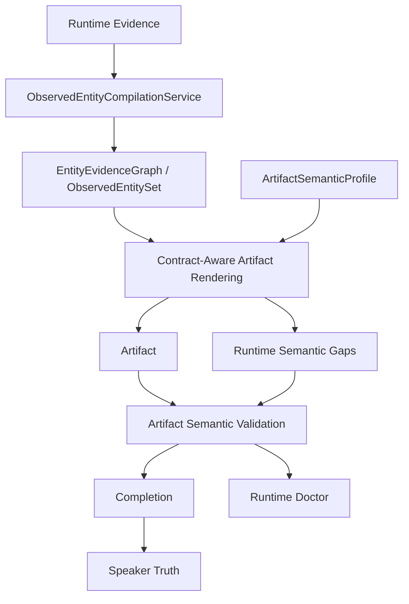

# AIpinho - ObservedEntity IR + Contract-Aware Artifact Rendering

## Objetivo da wave

Esta wave introduziu uma IR generica para entidades observadas antes da renderizacao de artifacts. O objetivo foi remover inteligencia indevida do renderer: ele deixa de interpretar evidencia bruta e passa a consumir entidades compiladas e contratos semanticos.

Nao foram criadas regras especificas para FireTest, musica, audio, CSV ou qualquer dominio. A mudanca opera sobre contratos, atributos observados, gaps semanticos e cobertura de schema.

## Pipeline cognitivo atualizado

## Responsabilidades movidas

- Antes: o renderer tabular recebia `analysis_payload.findings` e decidia schema fixo `severity,title,summary`.
- Agora: o Runtime readonly compila `observed_entity_graph` uma vez e o renderer tabular consome somente `EntityEvidenceGraph` + `declared_contract.expected_schema`.
- Antes: divergencia aparecia como schema errado.
- Agora: o schema segue o contrato e os gaps passam a indicar precisamente entidades/atributos ausentes, por exemplo `ENTITY_NOT_OBSERVED` ou `ATTRIBUTE_NOT_OBSERVED:<field>`.
- Antes: Runtime Doctor via artifact contract tinha leitura generica.
- Agora: Runtime Doctor separa dominios `entity_compilation`, `artifact_renderer` e `schema_coverage`.

## Arquivos alterados

- `src/aipinho/schemas/artifacts/observed_entity.py`: adiciona `ObservedEntityAttribute`, `ObservedEntity` e `EntityEvidenceGraph`.
- `src/aipinho/services/artifacts/observed_entity_compilation_service.py`: compila evidencias runtime em entidades genericas, seleciona entidades por cobertura de schema e calcula `schema_coverage`.
- `config/artifacts/observed_entity_policy.yaml`: move limites de varredura e aliases genericos de atributos para configuracao.
- `src/aipinho/services/governance/runtime/readonly_analysis_artifact_runtime_service.py`: compila `observed_entity_graph`, renderiza colecoes tabulares por contrato e propaga gaps semanticos para o contrato declarado do artifact.
- `src/aipinho/services/artifacts/artifact_semantic_contract_service.py`: incorpora `runtime_semantic_gaps`, `expected_entities`, `expected_cardinality`, `observed_entities` e `schema_coverage` ao perfil semantico.
- `src/aipinho/schemas/artifacts/artifact_semantic_profile.py`: expande o perfil com entidades e cobertura de schema.
- `src/aipinho/services/runtime/runtime_doctor_service.py` e `src/aipinho/schemas/runtime/runtime_doctor.py`: adicionam dominios de diagnostico para entity compilation, renderer e schema coverage.
- `src/aipinho/services/runtime_doctor/runtime_doctor_service.py`: mapeia gaps de entidade/schema para causas provaveis.
- `tests/unit/test_observed_entity_compilation_service.py`: cobre IR, selecao por schema, renderer por contrato e gaps de atributos ausentes.
- `tests/unit/test_artifact_semantic_contract_service.py`: cobre bloqueio semantico por gaps runtime.

## Impacto arquitetural

- Renderer ficou mais simples: renderiza colecoes a partir de uma IR e nao de evidencias brutas.
- ArtifactSemanticProfile ficou mais expressivo: agora consegue declarar o que esperava observar e o que de fato foi observado por entidade.
- Validation permaneceu rigorosa: artifacts com schema correto ainda bloqueiam se atributos contratados nao tiverem evidencia.
- Completion e Speaker Truth nao foram alterados para mascarar falhas.
- A melhoria e reutilizavel para futuros artifacts de arquivos, simbolos, endpoints, processos, documentos ou qualquer entidade representavel.

## Garantias preservadas

- Sem bypass.
- Sem relaxamento de Validation.
- Sem alteracao em Completion/Speaker Truth.
- Sem fluxo paralelo.
- Sem autoridade concorrente.
- Sem logica especifica para FireTest.
- Sem logica especifica para musica, audio ou CSV.

## Verificacao executada

- `python -m pytest tests\unit\test_observed_entity_compilation_service.py tests\unit\test_artifact_semantic_contract_service.py -q`
  - Resultado: 14 passed.
- `python -m pytest tests\unit\test_runtime_doctor_service.py -q`
  - Resultado: 12 passed.
- `python -m pytest tests\unit\test_observed_entity_compilation_service.py tests\unit\test_artifact_semantic_contract_service.py tests\unit\test_readonly_analysis_patch_preview.py -q`
  - Resultado: 17 passed.
- `python -m pytest tests\governance\test_runtime_vertical_slice.py -q`
  - Resultado: 11 passed em 208.56s.

## Leitura esperada para proximas execucoes

Se um artifact tabular declarar campos que a AIpinho nao observou, o artifact pode ter schema correto e ainda assim bloquear por gaps semanticos. Esse e o comportamento esperado: a plataforma nao deve inventar valores para satisfazer contrato.

No caso de inventarios futuros, o gargalo deve se deslocar para a coleta/observacao dos atributos declarados, nao mais para o renderer. Isso torna a proxima fronteira cognitiva mais precisa: observar atributos com evidencia suficiente para preencher entidades, em vez de ajustar manualmente artifacts.
