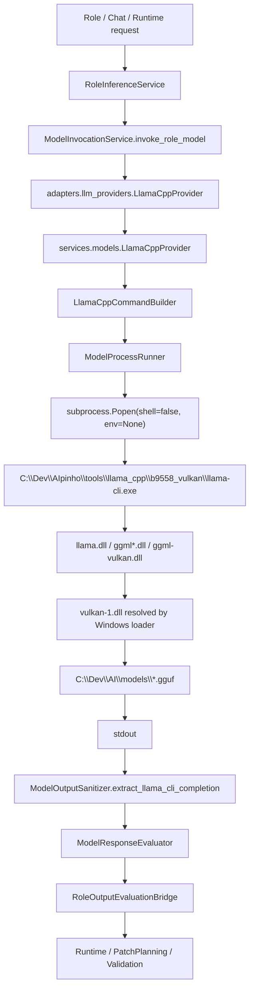

# Runtime Environment & LLM Engine Audit

Data: 2026-08-01

Escopo: auditoria read-only do ambiente de inferencia local da AIpinho, sem alterar codigo, Runtime, Policy, Patch Planning ou FireTest.

## Resumo Executivo

O ambiente possui mais de uma pasta de llama.cpp, mas os binarios core duplicados em `b9558` e `b9558_vulkan` possuem o mesmo hash. A AIpinho esta configurada para chamar explicitamente a instalacao `b9558_vulkan`, nao um executavel vindo do PATH.

O risco mais relevante encontrado nao e troca direta de `llama-cli.exe`, e sim fronteira de ambiente/DLL:

- `ModelProcessRunner` chama `subprocess.Popen(..., env=None)`, herdando o PATH completo do processo.
- O executavel e absoluto, mas a resolucao de DLL no Windows ainda pode ser influenciada pelo diretorio do executavel, System32 e PATH.
- Existe `C:\WINDOWS\system32\vulkan-1.dll` no PATH efetivo.
- Existem tambem DLLs Vulkan do Android SDK em `C:\Dev\Dependencias`, com hashes diferentes.
- A AIpinho usa `b9558_vulkan`, que possui `ggml-vulkan.dll`, mas nao foi encontrado `vulkan-1.dll` dentro da pasta do llama.cpp.

Isso sustenta uma hipotese moderada: o llama.cpp chamado e o correto, mas a fronteira de runtime pode depender de uma combinacao externa de DLL Vulkan/driver/PATH. Isso pode explicar comportamento variavel ou estranho, embora o bloqueio atual da Fase 4 tambem tenha evidencias de insuficiencia semantica do PatchCandidate.

## Respostas Diretas

| Pergunta | Resposta | Evidencia |
|---|---:|---|
| Existe mais de um llama.cpp? | SIM | `C:\Dev\AIpinho\tools\llama_cpp\b9558` e `C:\Dev\AIpinho\tools\llama_cpp\b9558_vulkan` |
| Existe mais de um Provider? | SIM | `llama_cpp_text`, `llama_cpp_vision`, `llama_cpp_ocr`, `llama_cpp_reranker`, `llama_cpp_embedding`, alem do legado `llama_cpp.local` desabilitado |
| Existe mais de um Wrapper? | SIM | Adapter fino em `adapters/llm_providers/llama_cpp_provider.py`, provider controlado em `services/models/llama_cpp_provider.py`, server runtime RAG separado |
| Existe mais de um Executavel? | SIM | `llama-cli.exe`, `llama-server.exe`, `llama-mtmd-cli.exe`, etc.; duplicados em duas pastas |
| Existe mais de uma instalacao Vulkan? | SIM | Vulkan SDK em `C:\VulkanSDK\1.4.350.0`; Android SDK possui DLLs Vulkan; System32 possui `vulkan-1.dll` |
| Existe DLL conflitante? | POTENCIAL | `vulkan-1.dll` aparece em System32 e Android SDK com hashes diferentes; llama.cpp depende de Vulkan sem DLL local propria |
| Existe PATH conflitante? | POTENCIAL | PATH efetivo inclui Vulkan SDK, System32 e outros runtimes; subprocess herda `env=None` |
| Existe modelo duplicado? | NAO no escopo auditado | 15 `.gguf`, todos em `C:\Dev\AI\models`, sem nomes duplicados |
| Existe configuracao duplicada? | SIM | Configs em `provider_registry.yaml`, `llama_cpp_policy.yaml`, `model_registry.yaml`, `chat_model_policy.yaml`, `manual_inference_profiles.yaml`, `rag/llama_server_runtime.yaml` |
| Quem realmente executa o modelo? | `C:\Dev\AIpinho\tools\llama_cpp\b9558_vulkan\llama-cli.exe` para texto/roles | Via `provider_registry.yaml` -> `LlamaCppProvider` -> `CommandBuilder` -> `ModelProcessRunner` |
| Quem a AIpinho acha que executa? | `C:\Dev\AIpinho\tools\llama_cpp\b9558_vulkan\llama-cli.exe` | `config\models\provider_registry.yaml` e `config\models\llama_cpp_policy.yaml` |
| Ha divergencia? | NAO para executable; SIM potencial para DLL/env | Executavel absoluto esta alinhado; ambiente herdado pode variar |

## Cadeia Real de Execucao

## Inventario de Binarios

Arquivos gerados:

- `C:\Dev\AIpinho\reports\runtime_environment_llm_binaries.json`
- `C:\Dev\AIpinho\reports\runtime_environment_models_light.json`
- `C:\Dev\AIpinho\reports\runtime_environment_paths.json`

Principais achados:

- Foram encontrados 100 binarios/DLLs relacionados a llama/ggml/vulkan/cuda no escopo.
- `llama-cli.exe` aparece em:
  - `C:\Dev\AIpinho\tools\llama_cpp\b9558\llama-cli.exe`
  - `C:\Dev\AIpinho\tools\llama_cpp\b9558_vulkan\llama-cli.exe`
- Ambos possuem o mesmo SHA256:
  - `BC9862679815785F22C5FEAFEF9416C6219D93B21867D27D351D4AF5872B5C61`
- `llama-server.exe` tambem aparece nas duas pastas com mesmo SHA256:
  - `0FD19C381E79A421B05F7108317315B6DFF64AF796D60F7DE064E218E8BD7001`
- `llama.dll` tambem e identica nas duas pastas:
  - `203AE292E0D226B71DFB2BE4C9B4A873E001170875DCA59B9CBCB5202A6AB1E4`
- `ggml-vulkan.dll` foi encontrado somente em:
  - `C:\Dev\AIpinho\tools\llama_cpp\b9558_vulkan\ggml-vulkan.dll`

Conclusao: existe duplicacao fisica, mas nao ha evidencia de versoes diferentes do core llama.cpp entre `b9558` e `b9558_vulkan`. A diferenca operacional relevante e a presenca do backend Vulkan em `b9558_vulkan`.

## Modelos GGUF

Foram encontrados 15 modelos `.gguf`, todos em:

- `C:\Dev\AI\models`

Total aproximado: 59.32 GB.

Nao foram encontrados nomes duplicados no escopo auditado.

Modelos relevantes para texto/coding:

- `Qwen2.5-Coder-7B-Instruct.Q4_K_M.gguf`
- `Qwen2.5-Coder-1.5B-Instruct.Q8_0.gguf`
- `qwen2.5-Coder-14B-q5_k_m.gguf`
- `starcoder2-7b-Q5_K_M.gguf`
- `DeepSeek-R1-Distill-Qwen-7B-Q5_K_M.gguf`
- `Qwen3-1.7B.Q6_K.gguf`

## Configuracao Encontrada

Texto/roles:

- Provider canonico: `llama_cpp_text`
- Executavel configurado: `C:\Dev\AIpinho\tools\llama_cpp\b9558_vulkan\llama-cli.exe`
- Modelo coding default: `qwen2_5_coder_7b_q4_k_m`
- Modelo do arquivo: `C:\Dev\AI\models\Qwen2.5-Coder-7B-Instruct.Q4_K_M.gguf`

Vision/OCR:

- Provider: `llama_cpp_vision` / `llama_cpp_ocr`
- Executavel: `C:\Dev\AIpinho\tools\llama_cpp\b9558_vulkan\llama-mtmd-cli.exe`

Embedding/Reranker:

- Provider: `llama_cpp_embedding` / `llama_cpp_reranker`
- Executavel: `C:\Dev\AIpinho\tools\llama_cpp\b9558_vulkan\llama-server.exe`

Legacy:

- `llama_cpp.local` existe, mas esta desabilitado em `provider_registry.yaml`.
- Ainda aparece em schemas, manual profiles e alguns endpoints de compatibilidade.

## PATH e Ambiente

PATH efetivo do processo contem:

- `C:\VulkanSDK\1.4.350.0\Bin`
- `C:\WINDOWS\system32`
- Python, Java, Git, Node, Ollama, Codex runtimes e outros.

Variaveis relevantes:

- `VULKAN_SDK=C:\VulkanSDK\1.4.350.0`
- `CUDA_PATH=null`

Arquivos `vulkan-1.dll` encontrados:

- `C:\WINDOWS\system32\vulkan-1.dll`
- `C:\Dev\Dependencias\Android\Sdk\emulator\lib64\gles_angle\vulkan-1.dll`
- `C:\Dev\Dependencias\Android\Sdk\emulator\lib64\vulkan\vulkan-1.dll`

Somente `C:\WINDOWS\system32\vulkan-1.dll` aparece diretamente resolvivel pelo PATH efetivo auditado. As DLLs do Android SDK nao aparecem no PATH atual, mas continuam sendo possiveis fontes de confusao caso algum launcher ou processo altere PATH.

## Riscos Tecnicos

1. Ambiente herdado pelo subprocess

`ModelProcessRunner` usa `env=None`, entao o processo do llama.cpp herda todo o ambiente do processo da AIpinho/Codex/Launcher. Isso aumenta a chance de comportamento diferente conforme quem iniciou o backend.

2. `cwd` nao fixado no subprocess

`subprocess.Popen` nao define `cwd`. Mesmo com executavel absoluto, o working directory pode variar. No Windows, isso pode interferir em resolucao de arquivos auxiliares, logs relativos e comportamento de algumas DLLs.

3. Duplicacao de configuracao

O mesmo dominio aparece em varias configs:

- `config\models\provider_registry.yaml`
- `config\models\llama_cpp_policy.yaml`
- `config\models\model_registry.yaml`
- `config\models\manual_inference_profiles.yaml`
- `config\chat\chat_model_policy.yaml`
- `config\rag\llama_server_runtime.yaml`

Nem todas sao concorrentes, mas ha risco de drift.

4. Legacy provider ainda exposto

`llama_cpp.local` esta desabilitado, mas aparece como default em alguns schemas/endpoints manuais. Isso nao parece afetar o fluxo canonico de roles, mas pode confundir diagnosticos.

5. Fronteira de stdout/parser

Em runs recentes, a saida persistida continha eco/truncamento do prompt antes do JSON, apesar de `--no-display-prompt`. O parser ainda conseguiu encontrar JSON, mas esse comportamento indica fronteira fragil entre llama-cli stdout e `ModelOutputSanitizer`.

## Hipotese Sobre o Problema Observado

Confianca: media.

O problema atual provavelmente nao e "AIpinho chamando outro llama-cli por PATH". O executavel configurado e absoluto e aponta para `b9558_vulkan`.

Mais provavel:

1. A fronteira llama.cpp/stdout/prompt-template esta fragil para prompts longos e contratos JSON.
2. O subprocess herda ambiente amplo, incluindo Vulkan SDK/System32, entao a camada Vulkan/DLL ainda pode variar conforme o processo pai.
3. O PatchCandidate ainda chega ao modelo como uma tarefa de replacement com evidencia pouco decisiva; o modelo responde vazio por falta de confiança.

## Recomendacoes Sem Alterar Runtime Agora

1. Rodar uma prova controlada de ambiente com o mesmo `llama-cli.exe`, mesmo modelo e mesmo prompt salvo em arquivo externo, comparando:
   - processo iniciado pelo backend;
   - processo iniciado por PowerShell limpo;
   - processo com PATH minimo.

2. Registrar em cada `RoleModelRun`:
   - executable absoluto;
   - model_path absoluto;
   - sanitized argv completo;
   - cwd efetivo;
   - hash do executable;
   - hash do model ou pelo menos size/mtime;
   - PATH fingerprint;
   - `VULKAN_SDK`;
   - DLL probe result para `vulkan-1.dll`.

3. Avaliar isolamento futuro do `ModelProcessRunner`:
   - `cwd` fixo no diretorio do executavel;
   - `env` governado/minimo;
   - PATH contendo primeiro a pasta do llama.cpp e depois os paths explicitamente permitidos.

4. Consolidar configuracao em uma fonte canonica:
   - Provider Registry decide executavel;
   - Model Registry decide modelo;
   - Runtime limits decidem ctx/output/timeout;
   - configs legacy apenas adaptam, sem autoridade propria.

5. Criar um `LLM Engine Doctor` read-only:
   - first-token probe real;
   - stdout echo detection;
   - JSON conformance probe;
   - Vulkan/DLL probe;
   - path divergence report.

## Veredito

ENGINE_ENVIRONMENT_AUDIT_COMPLETED

Nao foi encontrada divergencia entre o executavel que a AIpinho acha que chama e o executavel configurado para o fluxo de role text.

Foi encontrado risco real de ambiente herdado e DLL/PATH, especialmente ao usar `b9558_vulkan` sem ambiente isolado.

O proximo passo mais seguro e investigar a fronteira do `ModelProcessRunner`/llama.cpp com probes controlados antes de retomar o FireTest.
